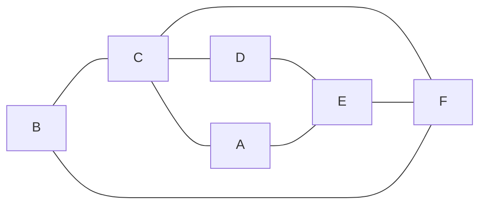
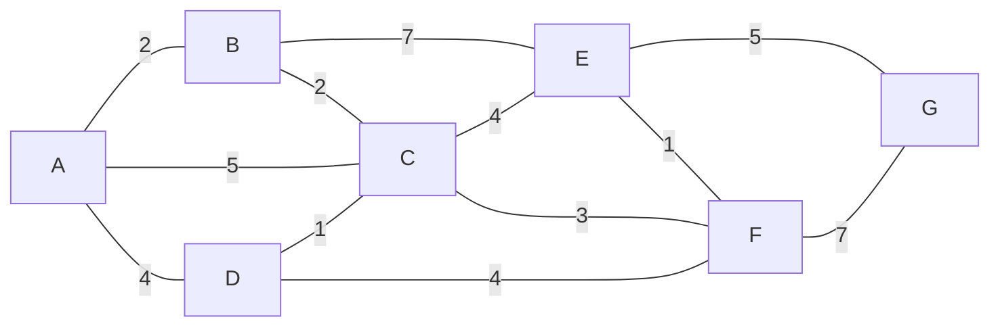
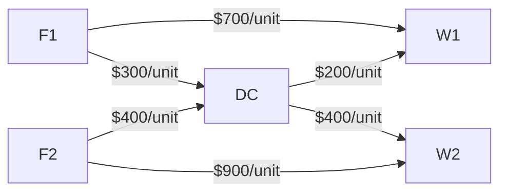

<b>运筹学自救笔记</b>

Zircon

2023年秋

[TOC]

# 线性规划与单纯形法

## 线性规划问题及标准型

* 可行解：满足线性规划模型约束条件的解
* 最优解：使目标函数达到最大（小）值的可行解
* 线性规划的解有四种情况：
  1. 唯一最优解
  1. 多重解（有两个及以上最优解就有无穷多个最优解）
  1. 无界解
  1. 无可行解（约束条件不能同时满足）

|          | 线性规划模型的一般型                                         | 线性规划模型的标准型                                         |
| :------: | :----------------------------------------------------------- | ------------------------------------------------------------ |
| 目标函数 | $\max (\text{or }\min) z = \sum_{j = 1}^n c_jx_j$            | $\max z = \sum_{j = 1}^n c_jx_j$                             |
| 约束条件 | $\begin{cases} \sum_{j = 1}^n a_{ij}x_j\le (\text{or }=,\ge)\  b_i,i = 1,2,\cdots,m \\ x_j\ge 0,j = 1,2,\cdots,n  \end{cases}$ | $\begin{cases} \sum_{j = 1}^n a_{ij}x_j=\  b_i,i = 1,2,\cdots,m \\ x_j\ge 0,j = 1,2,\cdots,n  \end{cases}$ |
|   要求   | 变量非负                                                     | 1. 目标函数为求最大值 2. 约束条件均为等式方程 3. 变量均为非负  4. 常数均为非负 |

更一般地，线性规划模型的标准型通常用矩阵表出：

$$
\begin{aligned}
& \max z = CX\\
\text{s.t. } & \begin{cases}

AX = b\\
X\ge 0

\end{cases}
\end{aligned}
$$
实际中通常面临的是线性规划模型的一般型，因此需要将线性规划的一般型转化为标准型。如下是几种常见情形：

|       情形        |                           转化方式                           |
| :---------------: | :----------------------------------------------------------: |
|  变量$x_t$无约束  | 将$x_t$表示为两个新非负变量的差值：$x_t = x_t'-x_t'',\text{ with }x_t',x_t''\ge0$ |
| 约束条件是$\le$号 |        在不等式左侧加入松弛变量（非负）转化为等式约束        |
| 约束条件是$\ge$号 |         在不等式左侧减去剩余变量（非负）化为等式约束         |
|  约束常数项为负   |     先在等式两侧同时乘上$-1$，再引入松弛变量化为等式约束     |
| 目标函数取最小值  |       令$z' = -z$，则$\min z \Longrightarrow \max z'$        |
| 绝对值不等式约束  |      将绝对值不等式化为两个不等式，再分别转化为等式约束      |

线性规划问题的基本术语：

* 矩阵$A$：$m\times n$矩阵，$m\le n$，并且$\rank (A) = m$

* 基矩阵：系数矩阵$A$的$m\times m$阶子矩阵$B$满足$\rank(B) = m$，则$B$为线性规划问题的一个基（或基矩阵

* 基向量：基矩阵对应的列向量为基向量

* 非基向量：基向量之外的其余列向量

* 基变量：基向量对应的变量

* 非基变量：非基向量对应的变量

* 可行解：满足线性规划模型约束条件的解

* 最优解：满足线性规划模型目标函数的可行解

* 基本解（基解）：对某一确定的基矩阵$B$，在约束条件$AX = b$中，令非基变量等于$0$，求解出基变量，称这组解为线性规划问题的基本解

* 基本可行解（基可行解）：若基本解满足$X\ge\boldsymbol 0$的非负约束，则称为基本可行解

* 可行解、基本解和基可行解的关系：

  

## 单纯形法

求解思路：先求出一个初始基本可行解，并判断其是否最优，若不是最优，再换一个基本可行解并判断，直到得出最优解或判定无最优解。

求解步骤：

* 步骤一：化标准型，求初始基本可行解，建立初始单纯形表

* 步骤二：求检验数并判断，若己得到最优解，结束计算;否则转入下一步

* 步骤三：基变换，构建新的单纯形表进行迭代

* 步骤四：重复步骤二、三，直到得出最优解或判断无最优解

---

例：用单纯形法求解下列线性规划问题
$$
\begin{aligned}
& \max z = 300 x_1 + 400 x_2\\
& \begin{cases}
2x_1 + x_2 \le 40\\
x_1 + \frac32 x_2 \le 30\\
x_1,x_2\ge0
\end{cases}
\end{aligned}
$$
解：加入松弛变量$x_3,x_4\ge 0$，将该线性规划转为标准型
$$
\begin{aligned}
& \max z = 300 x_1 + 400 x_2\\
& \begin{cases}
2x_1 + x_2 + x_3 \ \ \ \ \ \ \ \ \ = 40\\
x_1 + \frac32 x_2 \ \ \ \ \ \ \ \ + x_4 = 30\\
x_1,x_2,x_3,x_4\ge0
\end{cases}
\end{aligned}
$$
观察出松弛变量的系数构成单位子矩阵，取松弛变量$x_3,x_4$为基变量，令非基变量等于$0$，则可以得到初始基本可行解：$X^{(0)} = (0,0,40,30)^T$。在初始基本可行解基础上，构建初始单纯形表：

|       |       | $c_j$      | $300$ | $400$     | $0$   | $0$   |      |
| :---: | ----- | ---------- | :---: | --------- | ----- | ----- | ---- |
| $C_B$ | $X_B$ | $b$        | $x_1$ | $x_2$     | $x_3$ | $x_4$ |      |
|  $0$  | $x_3$ | $40$       |  $2$  | $1$       | $1$   | $0$   |      |
|  $0$  | $x_4$ | $30$       |  $1$  | $\frac32$ | $0$   | $1$   |      |
|       |       | $\sigma_j$ | $300$ | $400$     | $0$   | $0$   |      |

---

最后一行为检验数$\sigma_j$，检验数是判断目标函数是否取得最优的重要判据。检验数的定义如下：

$$
\sigma_j = c_j - \sum_{i = 1}^m c_ia_{ij}
$$
检验数$\sigma_j$可以理解为，**增加一单位$x_j$能为目标函数带来的增益**：

* $+c_j$：增加一单位$x_j$直接带来的目标函数值增加
* $-\sum\limits_{i = 1}^m a_{ij}c_i$：增加一单位$x_j$的同时，为满足约束条件而要减少基变量所引起的目标函数值减小（在第$i$个约束条件中，增加一单位$x_j$，需要减少$a_{ij}$单位$x_i$，导致目标函数减少$a_{ij}c_i$）

根据检验数的定义，或从检验数的含义出发，都可以快速观察到：基变量所对应的检验数必为$0$。

检验数判断规则（目标函数求$\max$，且无人工变量的情况）：

1. 所有检验数都满足$\sigma_j\le 0$，得到最优解。在此基础上，还要判断非基变量的检验数是否有为$0$的情况：
   * 若所有非基变量的检验数均小于$0$，则为唯一最优解
   * 若存在非基变量的检验数为$0$，则为多重解（可以理解为将检验数为$0$的非基变量换入基后不影响目标的实现，而换基实现了变换单纯形的顶点，那么顶点之间的可行解均对应最优解）
2. 若存在检验数$\sigma_k>0$，并且其对应的变量$x_k$的系数列向量$P_k\le \boldsymbol 0$，则为无界解，直接停止计算（可以理解为将该变量换入基后一方面会增加目标函数值，另一方面该变量的增益不仅不以基变量的减小为代价，反而增大基变量，故可以无限做大目标函数）

第一次迭代后发现，并非所有的检验数均满足$\sigma_j\le 0$，故基变换，进行迭代。

寻找$\sigma_j$的最大值$\sigma_k = \max{\sigma_j}$，其对应列的变量$x_k$为入基变量。之后要确定出基变量，规则是寻找$\theta_i$的最小值$\theta_l = \min \theta _i$，其对应行的$x_l$为出基变量，其中$\theta_i$定义为：

$$
\theta_i = \frac{b_i}{a_{ik}},a_{ik}>0
$$

由$\max \sigma_j$和$\min \theta_i$确定主元，主元所在行对应出基变量，主元所在列对应入基变量，用$[\ ]$表出主元。

---

通常来说，检验数不满足最优解条件才计算$\theta_i$列并确定主元：

|       |       |   $c_j$    | $300$ |    $400$    |  $0$  |  $0$  |            |
| :---: | :---: | :--------: | :---: | :---------: | :---: | :---: | :--------: |
| $C_B$ | $X_B$ |    $b$     | $x_1$ |    $x_2$    | $x_3$ | $x_4$ | $\theta_i$ |
|  $0$  | $x_3$ |    $40$    |  $2$  |     $1$     |  $1$  |  $0$  |    $40$    |
|  $0$  | $x_4$ |    $30$    |  $1$  | $[\frac32]$ |  $0$  |  $1$  |    $20$    |
|       |       | $\sigma_j$ | $300$ |    $400$    |  $0$  |  $0$  |            |

之后就可以进行第一次迭代。首先在表左侧对应修改基和基系数的信息。之后将主元变换为$1$，并将主元所在列的其他元素化为$0$（通过初等行变换实现）。最后重新计算检验数$\sigma_j$，判定检验数情况，如需要进一步迭代，则再次计算$\theta_i$，确定新的主元。得到迭代后的单纯形表：

|       |       |   $c_j$    |     $300$     | $400$ |  $0$  |      $0$       |            |
| :---: | :---: | :--------: | :-----------: | :---: | :---: | :------------: | :--------: |
| $C_B$ | $X_B$ |    $b$     |     $x_1$     | $x_2$ | $x_3$ |     $x_4$      | $\theta_i$ |
|  $0$  | $x_3$ |    $20$    |  $[\frac43]$  |  $0$  |  $1$  |   $-\frac23$   |    $15$    |
| $400$ | $x_2$ |    $20$    |   $\frac23$   |  $1$  |  $0$  |   $\frac23$    |    $30$    |
|       |       | $\sigma_j$ | $\frac{100}3$ | $400$ |  $0$  | $-\frac{800}3$ |            |

在本例中，由检验数判断规则知需要再次迭代，得到

|       |       |   $c_j$    | $300$ | $400$ |    $0$    |    $0$     |            |
| :---: | :---: | :--------: | :---: | :---: | :-------: | :--------: | :--------: |
| $C_B$ | $X_B$ |    $b$     | $x_1$ | $x_2$ |   $x_3$   |   $x_4$    | $\theta_i$ |
| $300$ | $x_1$ |    $15$    |  $1$  |  $0$  | $\frac43$ | $-\frac12$ |            |
| $400$ | $x_2$ |    $10$    |  $0$  |  $1$  |    $0$    |    $1$     |            |
|       |       | $\sigma_j$ |  $0$  |  $0$  |   $-25$   |   $-250$   |            |

由此，所有的检验数均小于$0$，确定了最优解：
$$
\begin{cases}
X = (15,100,0,0)^T\\
\max z = 300 x_1 + 400 x_2 = 8500
\end{cases}
$$

## 大$M$法与两阶段法

通常在从线性规划的一般型向标准型的转化中，引入松弛变量后可以观察到直接的**单位矩阵**作为基矩阵，由此得到初始基本可行解以开始单纯形法的迭代。但有的情况下并不能直观得出基矩阵，因此采取引入人工变量的方法，使得有直观的基矩阵开始运算。

---

比如如下实例，就不能从标准型中直接观察出单位矩阵作为基矩阵：

$$
\begin{aligned}
& \max z = 3x_1 + 2x_2 - x_3\\
& \begin{cases}
-4x_1 + 3x_2 + x_3 \ge 4\\
x_1 - x_2 + 2x_3 \le10\\
- 2x_1 + 2x_2 - x_3 = -1\\
x_j\ge 0, j = 1,2,3
\end{cases}
\end{aligned}
\Longrightarrow 
\begin{aligned}
& \max z = 3x_1 + 2x_2 - x_3\\
& \begin{cases}
-4x_1 + 3x_2 + x_3 -x_4 = 4\\
x_1 - x_2 + 2x_3 + x_5 = 10\\
2x_1 - 2x_2 + x_3 = 1\\
x_j\ge 0, j = 1,2,3,4,5
\end{cases}
\end{aligned}
$$
从标准型的系数矩阵中，并不能直接找到基矩阵，只有$x_5$可以作为一个基变量。因此，继续在第一和第三个约束中分别加入人工变量$x_6$和$x_7$（注意，并不要求基矩阵是单位矩阵，基矩阵可以是单位阵的排列）：
$$
\begin{cases}
-4x_1 + 3x_2 + x_3 -x_4 + x_6 = 4\\
x_1 - x_2 + 2x_3 + x_5 = 10\\
2x_1 - 2x_2 + x_3 + x_7= 1\\
x_j\ge 0, j = 1,2,3,4,5
\end{cases}
\Longrightarrow
\begin{bmatrix}
-4 & 3 & 1 & -1 & 0 & 1 & 0\\
1 & -1 & 2 & 0 & 1 & 0 & 0\\
2 & -2 & 1 & 0 & 0 & 0 & 1
\end{bmatrix}
$$

---

添加人工变量之后，相当于对约束条件施加改变，这可能会对解的情况造成影响。由于人工变量是在原问题之外人为添加的，因此若线性规划有最优解，则人工变量必定为$0$。人工变量法的思路总结如下：

* 构造人工变量的情况：若系数矩阵中不存在单位矩阵，则加入非负的人工变量，构造一个单位矩阵
* 最优解分析：若线性规划有最优解，则人工变量必定为$0$
* 求解思路：为使人工变量为$0$，由于人工变量初始作为基变量，那么就要使人工变量从基变量中出基变为非基变量
* 求解方法：大$M$法和两阶段法

### 大$M$法

|      原问题      | 人工变量在目标函数中的系数 （$M$为任意大的正数） |                  求解原理                   |
| :--------------: | :-------------------------------------------------: | :-----------------------------------------: |
| 目标函数求$\max$ |                        $-M$                         | 为最大化，必须对人工变量的存在施加惩罚($-$) |
| 目标函数求$\min$ |                         $M$                         | 为最小化，必须对人工变量的存在施加惩罚($+$) |

---

用大$M$法求解上述问题，数学模型转化为：
$$
\begin{aligned}
& \max z = 3x_1 + 2x_2 - x_3- Mx_6-Mx_7\\
& \begin{cases}
-4x_1 + 3x_2 + x_3 -x_4 +x_6= 4\\
x_1 - x_2 + 2x_3 + x_5 = 10\\
2x_1 - 2x_2 + x_3+x_7 = 1\\
x_j\ge 0, j = 1,2,3,4,5
\end{cases}\\
& \text{其中}M\text{为任意大的正数}
\end{aligned}
$$

以$x_5$、$x_6$和$x_7$为基变量，构建初始单纯形表：

|       |       |   $c_j$    |  $3$   |  $2$  |  $-1$   |  $0$  |  $0$  | $-M$  | $-M$  |            |
| :---: | :---: | :--------: | :----: | :---: | :-----: | :---: | :---: | :---: | :---: | :--------: |
| $C_B$ | $X_B$ |    $b$     | $x_1$  | $x_2$ |  $x_3$  | $x_4$ | $x_5$ | $x_6$ | $x_7$ | $\theta_i$ |
| $-M$  | $x_6$ |    $4$     |  $-4$  |  $3$  |   $1$   | $-1$  |  $0$  |  $1$  |  $0$  |    $4$     |
|  $0$  | $x_5$ |    $10$    |  $1$   | $-1$  |   $2$   |  $0$  |  $1$  |  $0$  |  $0$  |    $5$     |
| $-M$  | $x_7$ |    $1$     |  $2$   | $-2$  |  $[1]$  |  $0$  |  $0$  |  $0$  |  $1$  |    $1$     |
|       |       | $\sigma_j$ | $3-2M$ | $2+M$ | $-1+2M$ | $-M$  |  $0$  |  $0$  |  $0$  |            |

---

由于大$M$法中有人工变量的引进，因此检验数判断规则较之前略有变化。检验数判断规则（目标函数求$\max$，且含有人工变量的情况）：

1. 所有检验数都满足$\sigma_j\le 0$，且**基变量中无人工变量**，则得到最优解。同时，还需要判断非基变量的检验数：
   * 若所有非基变量的检验数均小于$0$，则为唯一最优解
   * 若存在非基变量的检验数为$0$，则为多重解
2. 所有检验数都满足$\sigma_j\le 0$，但基变量中含有非零的人工变量，则无可行解
   * 注：基变量有可能取值为$0$，此时为退化解
3. 若存在检验数$\sigma_k>0$，且其对应的变量$x_k$的系数列向量$P_k\le \boldsymbol 0$，则为无界解

---

可以发现，第一次迭代后仍有大于$0$的检验数，因此继续迭代：

|       |       |   $c_j$    |  $3$   |  $2$  | $-1$  |  $0$  |  $0$  | $-M$  |  $-M$  |              |
| :---: | :---: | :--------: | :----: | :---: | :---: | :---: | :---: | :---: | :----: | :----------: |
| $C_B$ | $X_B$ |    $b$     | $x_1$  | $x_2$ | $x_3$ | $x_4$ | $x_5$ | $x_6$ | $x_7$  |  $\theta_i$  |
| $-M$  | $x_6$ |    $3$     |  $-6$  | $[5]$ |  $0$  | $-1$  |  $0$  |  $1$  |  $-1$  |  $\frac35$   |
|  $0$  | $x_5$ |    $8$     |  $-3$  |  $3$  |  $0$  |  $0$  |  $1$  |  $0$  |  $-2$  |  $\frac83$   |
| $-1$  | $x_3$ |    $1$     |  $2$   | $-2$  |  $1$  |  $0$  |  $0$  |  $0$  |  $1$   | $\backslash$ |
|       |       | $\sigma_j$ | $5-6M$ | $5M$  |  $0$  | $-M$  |  $0$  |  $0$  | $1-2M$ |              |

检验数仍然不满足最优解条件，继续迭代：

|       |       |    $c_j$     |     $3$     |  $2$  | $-1$  |    $0$     |      $0$      |    $-M$    |      $-M$      |              |
| :---: | :---: | :----------: | :---------: | :---: | :---: | :--------: | :-----------: | :--------: | :------------: | :----------: |
| $C_B$ | $X_B$ |     $b$      |    $x_1$    | $x_2$ | $x_3$ |   $x_4$    |     $x_5$     |   $x_6$    |     $x_7$      |  $\theta_i$  |
|  $2$  | $x_2$ |  $\frac35$   | $-\frac65$  |  $1$  |  $0$  | $-\frac15$ |      $0$      | $\frac15$  |   $-\frac15$   | $\backslash$ |
|  $0$  | $x_5$ | $\frac{31}5$ | $[\frac35]$ |  $0$  |  $0$  | $\frac35$  |      $1$      | $-\frac35$ |   $-\frac75$   | $\frac{31}3$ |
| $-1$  | $x_3$ | $\frac{11}5$ | $-\frac25$  |  $0$  |  $1$  | $-\frac25$ |      $0$      | $\frac25$  |   $\frac35$    | $\backslash$ |
|       |       |  $\sigma_j$  |     $5$     |  $0$  |  $0$  |    $0$     |      $0$      |    $-M$    |     $1-M$      |              |
|  $2$  | $x_2$ |     $13$     |     $0$     |  $1$  |  $0$  |    $1$     |      $2$      |    $-1$    |      $-3$      |              |
|  $3$  | $x_1$ | $\frac{31}3$ |     $1$     |  $0$  |  $0$  |    $1$     |   $\frac53$   |    $-1$    |   $-\frac73$   |              |
| $-1$  | $x_3$ | $\frac{19}3$ |     $0$     |  $0$  |  $1$  |    $0$     |   $\frac23$   |    $0$     |   $-\frac13$   |              |
|       |       |  $\sigma_j$  |     $0$     |  $0$  |  $0$  |    $-5$    | $-\frac{25}3$ |   $5-M$    | $\frac{38}3-M$ |              |

发现此时检验数满足最优解条件，并且基变量中无人工变量，由此确定最优解为
$$
\begin{cases}
X = \left(\frac{31}3,13,\frac{19}3,0,0,0,0\right)^T\\
\max z = 3x_1+2x_2-x_3 = \frac{152}3
\end{cases}
$$
注：大$M$法中计算捷径——人工变量作为出基变量换出之后，不可能再次作为入基变量，因此换出后不必对其再进行计算（包括系数和检验数）。

### 两阶段法

* 第一阶段：
  * 决策变量：原问题位置变量+松弛变量+人工变量
  * 目标函数：人工变量之和求最小值
  * 约束条件：原问题加入人工变量之后的约束条件
  * 最优解判断：若得到最优目标函数值为$0$，说明原问题有基可行解，可以进行第二阶段的计算；反之，说明原问题无可行解，直接停止计算
* 第二阶段
  * 决策变量：原问题位置变量+松弛变量（去除第一阶段的人工变量）
  * 目标函数：原问题的目标函数
  * 约束条件：将第一阶段得到的最终表，去除人工变量列（相当于去除人工变量后求解原问题）

---

仍以大$M$法中的例题为例，这次用两阶段法求解最优化问题：

$$
\begin{aligned}
& \begin{aligned}
& \max z = 3x_1 + 2x_2 - x_3\\
& \begin{cases}
-4x_1 + 3x_2 + x_3 \ge 4\\
x_1 - x_2 + 2x_3 \le10\\
- 2x_1 + 2x_2 - x_3 = -1\\
x_j\ge 0, j = 1,2,3
\end{cases}
\end{aligned}
\Longrightarrow 
\begin{aligned}
& \max z = 3x_1 + 2x_2 - x_3\\
& \begin{cases}
-4x_1 + 3x_2 + x_3 -x_4 = 4\\
x_1 - x_2 + 2x_3 + x_5 = 10\\
2x_1 - 2x_2 + x_3 = 1\\
x_j\ge 0, j = 1,2,3,4,5
\end{cases}
\end{aligned}\\
\\
& \text{两阶段法之第一阶段：}\\
 \Longrightarrow & 
 \begin{aligned}
& \min W = x_6+x_7\\
& \begin{cases}
-4x_1 + 3x_2 + x_3 -x_4 = 4\\
x_1 - x_2 + 2x_3 + x_5 = 10\\
2x_1 - 2x_2 + x_3 = 1\\
x_j\ge 0, j = 1,2,3,4,5
\end{cases}\\
\end{aligned}
\end{aligned}
$$
构建初始单纯形表如下：

|       |       |   $c_j$    |  $0$  |  $0$  |  $0$  |  $0$  |  $0$  |  $1$  |  $1$  |            |
| :---: | :---: | :--------: | :---: | :---: | :---: | :---: | :---: | :---: | :---: | :--------: |
| $C_B$ | $X_B$ |    $b$     | $x_1$ | $x_2$ | $x_3$ | $x_4$ | $x_5$ | $x_6$ | $x_7$ | $\theta_i$ |
|  $1$  | $x_6$ |    $4$     | $-4$  |  $3$  |  $1$  | $-1$  |  $0$  |  $1$  |  $0$  |    $4$     |
|  $0$  | $x_5$ |    $10$    |  $1$  | $-1$  |  $2$  |  $0$  |  $1$  |  $0$  |  $0$  |    $5$     |
|  $1$  | $x_7$ |    $1$     |  $2$  | $-2$  | $[1]$ |  $0$  |  $0$  |  $0$  |  $1$  |    $1$     |
|       |       | $\sigma_j$ |  $2$  | $-1$  | $-2$  |  $1$  |  $0$  |  $0$  |  $0$  |            |

注意，此时是求解最小值问题，因此需要所有检验数都满足$\sigma_j\ge 0$，才得到最优解。如果不满足，则要进行基变换，选择$\sigma_j$的最小值对应的变量为入基变量。计算$\theta_i$以选择出基变量，注意此时的选择标准同求解最大值问题，是选择**$\theta_i$最小**所在行的变量为出基变量。

|       |       |    $c_j$     |     $0$     |  $0$  |  $0$  |    $0$     |  $0$  |    $1$     |    $1$     |              |
| :---: | :---: | :----------: | :---------: | :---: | :---: | :--------: | :---: | :--------: | :--------: | :----------: |
| $C_B$ | $X_B$ |     $b$      |    $x_1$    | $x_2$ | $x_3$ |   $x_4$    | $x_5$ |   $x_6$    |   $x_7$    |  $\theta_i$  |
|  $1$  | $x_6$ |     $3$      |    $-6$     | $[5]$ |  $0$  |    $-1$    |  $0$  |    $1$     |    $-1$    |  $\frac35$   |
|  $0$  | $x_5$ |     $8$      |    $-3$     |  $3$  |  $0$  |    $0$     |  $1$  |    $0$     |    $-2$    |  $\frac83$   |
|  $0$  | $x_3$ |     $1$      |     $2$     | $-2$  |  $1$  |    $0$     |  $0$  |    $0$     |    $1$     | $\backslash$ |
|       |       |  $\sigma_j$  |     $6$     | $-5$  |  $0$  |    $1$     |  $0$  |    $0$     |    $2$     |              |
|  $2$  | $x_2$ |  $\frac35$   | $-\frac65$  |  $1$  |  $0$  | $-\frac15$ |  $0$  | $\frac15$  | $-\frac15$ |              |
|  $0$  | $x_5$ | $\frac{31}5$ | $[\frac35]$ |  $0$  |  $0$  | $\frac35$  |  $1$  | $-\frac35$ | $-\frac75$ |              |
| $-1$  | $x_3$ | $\frac{11}5$ | $-\frac25$  |  $0$  |  $1$  | $-\frac25$ |  $0$  | $\frac25$  | $\frac35$  |              |
|       |       |  $\sigma_j$  |     $0$     |  $0$  |  $0$  |    $0$     |  $0$  |    $1$     |    $1$     |              |

此时，观察到所有的检验数已经大于$0$，因此对应第一阶段问题的最优解。观察到$x_6$和$x_7$作为非基变量，取值为$0$，说明原问题有可行解，进入第二阶段的计算。

第二阶段问题实际上就是线性规划问题的标准型：
$$
\begin{aligned}
& \max z = 3x_1 + 2x_2 - x_3\\
& \begin{cases}
-4x_1 + 3x_2 + x_3 -x_4 = 4\\
x_1 - x_2 + 2x_3 + x_5 = 10\\
2x_1 - 2x_2 + x_3 = 1\\
x_j\ge 0, j = 1,2,3,4,5
\end{cases}
\end{aligned}
$$
若直接由此出发同样无法得到初始基本可行解，但可以在第一阶段的基础上确定初始可行解为第一阶段目标函数为$0$的最优解。构建初始单纯形表，注意此时的价值系数是原问题目标函数的价值系数：

|       |         |    $c_j$     |     $0$     |  $0$  |  $0$  |    $0$     |      $0$      |     $1$      |
| :---: | :-----: | :----------: | :---------: | :---: | :---: | :--------: | :-----------: | :----------: |
| $C_B$ | $$X_B$$ |     $b$      |    $x_1$    | $x_2$ | $x_3$ |   $x_4$    |    $$x_5$$    |  $\theta_i$  |
|  $2$  |  $x_2$  |  $\frac35$   | $-\frac65$  |  $1$  |  $0$  | $-\frac15$ |      $0$      | $\backslash$ |
|  $0$  |  $x_5$  | $\frac{31}5$ | $[\frac35]$ |  $0$  | $$0$$ | $\frac35$  |      $1$      | $\frac{31}3$ |
| $-1$  |  $x_3$  | $\frac{11}5$ | $-\frac25$  |  $0$  |  $1$  | $-\frac25$ |      $0$      | $\backslash$ |
|       |         |  $\sigma_j$  |     $5$     |  $0$  |  $0$  |    $0$     |      $0$      |              |
|  $2$  |  $x_2$  |    $$13$$    |     $0$     |  $1$  |  $0$  |    $1$     |      $2$      |              |
|  $3$  |  $x_1$  | $\frac{31}3$ |     $1$     |  $0$  | $$0$$ |    $1$     |   $\frac53$   |              |
| $-1$  |  $x_3$  | $\frac{19}3$ |     $0$     |  $0$  |  $1$  |    $0$     |   $\frac23$   |              |
|       |         |  $\sigma_j$  |     $0$     |  $0$  |  $0$  |    $-5$    | $-\frac{25}3$ |              |

此时检验数满足最优解的条件，由此确定最优解为：
$$
\begin{cases}
X = \left(\frac{31}3,13,\frac{19}3,0,0,0,0\right)^T\\
\max z = 3x_1+2x_2-x_3 = \frac{152}3
\end{cases}
$$

---

在大$M$法和两阶段法的原理和计算中的比较可以发现：

* 大$M$法的计算更为复杂，但不容易出错
* 两阶段法的易错点是第一阶段求解**最小值问题**，以及从第一阶段到第二阶段的转化

## 目标函数求极小值

### 转化求解$\max$

求解思路：

1. 将目标函数转化为求解极大值问题
   $$
   \min z = \sum_{j = 1}^n c_j x_j \overset {w = -z}{\Longrightarrow} \min (-w) = \sum_{j = 1}^n c_jx_j \iff \max w = -\sum_{j = 1}^n c_jx_j
   $$

2. 按照单纯形法求解该极大值问题

3. 最终需要将目标函数值$w^*$转化回$z^*$。

这些方法在前文已经做了详尽的介绍，此处不再赘述。

### 直接求解$\min$

求解思路：按照**单纯形法**求解极大值问题的步骤求解，但注意两点区别：

1. 目标函数求$\min$，**检验数判断最优解的准则不同**
   1. 所有检验数都满足$\sigma_j\ge 0$，且**基变量中无人工变量**，则得到最优解。同时，还需要判断非基变量的检验数：
      * 若所有非基变量的检验数均大于$0$，则为唯一最优解
      * 若存在非基变量的检验数为$0$，则为多重解
   2. 所有检验数都满足$\sigma_j\ge 0$，但基变量中含有非零的人工变量，则无可行解
      * 注：基变量有可能取值为$0$，此时为退化解
   3. 若存在检验数$\sigma_k<0$，且其对应的变量$x_k$的系数列向量$P_k\le \boldsymbol 0$，则为无界解
      * 注：此时对列向量的要求仍为$P_k\le \boldsymbol 0$，与求解最大值问题的判别条件相同，因为$P_k\le\boldsymbol 0$对应着$x_k$可以无限增大，那么目标函数就可以朝着$\sigma_k$的方向无限变化
2. 目标函数求$\min$，**基变换确定入基变量的方法不同**
   * 寻找小于$0$的$\sigma_j$中的最小值，将其对应列的变量作为入基变量
   * 注：$\theta_i$的计算方式和出基变量判定规则同求解最大值问题

---

例：求解如下最小值问题

$$
\begin{aligned}
& \min z = 2x_1 - 2x_2-x_4\\
& \begin{cases}
x_1+x_2+x_3 = 5\\
-x_1+x_2+x_4 = 6\\
6x_1+2x_2+x_5 = 21\\
x_j\ge 0,j = 1,2,3,4,5
\end{cases}
\end{aligned}
$$

|       |         |   $c_j$    |  $2$  |  $-2$   |  $0$  | $-1$  |   $0$   |              |
| :---: | :-----: | :--------: | :---: | :-----: | :---: | :---: | :-----: | :----------: |
| $C_B$ | $$X_B$$ |    $b$     | $x_1$ |  $x_2$  | $x_3$ | $x_4$ | $$x_5$$ |  $\theta_i$  |
|  $0$  |  $x_3$  |    $5$     |  $1$  | $$[1]$$ |  $1$  |  $0$  |   $0$   |      5       |
| $-1$  | $$x_4$$ |    $6$     | $-1$  |   $1$   | $$0$$ |  $1$  |   $0$   |     $6$      |
|  $0$  |  $x_5$  |    $21$    |  $6$  |   $2$   |  $0$  |  $0$  |   $1$   | $\frac{21}2$ |
|       |         | $\sigma_j$ |  $1$  |  $-1$   |  $0$  |  $0$  |   $0$   |              |
|  $2$  |  $x_2$  |   $$5$$    |  $1$  |   $1$   |  $1$  |  $0$  |   $0$   |              |
| $-1$  |  $x_4$  |   $$1$$    | $-2$  |   $0$   | $-1$  |  $1$  |   $0$   |              |
|  $0$  |  $x_5$  |    $11$    |  $4$  |   $0$   | $-2$  |  $0$  |   $1$   |              |
|       |         | $\sigma_j$ |  $2$  |   $0$   |  $1$  |  $0$  |   $0$   |              |

由此确定最优解为：
$$
\begin{cases}
X = \left(0,5,0,1,11\right)^T\\
\min z = 2x_1-2x_2-x_4 = -11
\end{cases}
$$

## 特殊解情形

### 多重解

考虑如下线性规划问题：

$$
\begin{aligned}
& \max z = 2x_1 + 4x_2\\
& \begin{cases}
x_1+2x_2\le 5\\
x_1+x_2\le 4\\
x_1,x_2\ge 0
\end{cases}
\end{aligned}
\Longrightarrow 
\begin{aligned}
& \max z = 2x_1 + 4x_2\\
& \begin{cases}
x_1+2x_2+x_3 = 5\\
x_1+x_2+x_4=  4\\
x_1,x_2,x_3,x_4\ge 0
\end{cases}
\end{aligned}
$$

构建单纯形表：

|       |       |   $c_j$    |    $2$    |  $4$  |    $0$     |  $0$  |            |
| :---: | :---: | :--------: | :-------: | :---: | :--------: | :---: | :--------: |
| $C_B$ | $X_B$ |    $b$     |   $x_1$   | $x_2$ |   $x_3$    | $x_4$ | $\theta_i$ |
|  $0$  | $x_3$ |    $5$     |    $1$    | $[2]$ |    $1$     |  $0$  | $\frac52$  |
|  $0$  | $x_4$ |    $4$     |    $1$    |  $1$  |    $0$     |  $1$  |    $4$     |
|       |       | $\sigma_j$ |    $2$    |  $4$  |    $0$     |  $0$  |            |
|  $4$  | $x_2$ | $\frac52$  | $\frac12$ |  $1$  | $\frac12$  |  $0$  |            |
|  $0$  | $x_4$ | $\frac32$  | $\frac12$ |  $0$  | $-\frac12$ |  $1$  |            |
|       |       | $\sigma_j$ |    $0$    |  $0$  |    $-2$    |  $0$  |            |

由此确定一个最优解为：
$$
\begin{cases}
X_1^* = \left(0,\frac52,0,\frac32\right)^T\\
\max z^*_1 = 2x_1+4x_2 = 10
\end{cases}
$$
但注意到此时非基变量$x_1$的检验数也等于$0$，此时必然有多重解。为求出第二个最优解（顶点），将检验数等于$0$的非基变量确定为入基变量，再进行一次迭代：

|       |       |   $c_j$    |  $2$  |  $4$  |  $0$  |  $0$  |            |
| :---: | :---: | :--------: | :---: | :---: | :---: | :---: | :--------: |
| $C_B$ | $X_B$ |    $b$     | $x_1$ | $x_2$ | $x_3$ | $x_4$ | $\theta_i$ |
|  $4$  | $x_2$ |    $1$     |  $0$  |  $1$  |  $1$  | $-1$  |            |
|  $2$  | $x_1$ |    $3$     |  $1$  |  $0$  | $-1$  |  $2$  |            |
|       |       | $\sigma_j$ |  $0$  |  $4$  | $-2$  |  $0$  |            |

由此确定另一个最优解为：
$$
\begin{cases}
X_2^* = \left(3,1,0,0\right)^T\\
\max z^*_2 = 2x_1+4x_2 = 10
\end{cases}
$$

在图形上，多重解的情形体现为：

如图，线段$AB$上的可行解均为目标函数的最优解，因此存在无穷多个最优解，这无穷多个解可以由顶点的凸组合表出。在图像上，出现多重解的原因是目标函数平行于非冗余的紧约束（即在最优解处作为方程被满足的约束）。总结如下：

|          出现多重解的原因          | 目标函数平行于非冗余的紧约束（即在最优解处作为方程被满足的约束） |
| :--------------------------------: | ------------------------------------------------------------ |
| 单纯形法检验数$\sigma_j$判断多重解 | 极大值问题($\max$)，要求同时满足 1. 所有检验数$\sigma\le0$ 2. 基变量中无非零人工变量 3. 存在非基变量的检验数为$0$ |
|                                    | 极小值问题($\min$)，要求同时满足 1. 所有检验数$\sigma\ge 0$ 2. 基变量中无非零人工变量 3. 存在非基变量的检验数为$0$ |
|       如何求解无穷多个最优解       | 两个最优解：求得一个最优解$X_1^*$后，以检验数为$0$的**非基变量**为入基变量，再进行一次单纯形法迭代运算即可得到另一个最优解$X_2^*$； 其他最优解：由$X_1^*$和$X_2^*$的线性凸组合$X^* = \alpha X_1^* + (1-\alpha)X_2^*,\alpha\in [0,1]$表出 |

### 无界解

考虑如下求解最大值问题：

$$
\begin{aligned}
& \max z = 2x_1 + x_2\\
& \begin{cases}
x_1-x_2\le 10\\
2x_2\le 40\\
x_1,x_2\ge 0
\end{cases}
\end{aligned}
\Longrightarrow 
\begin{aligned}
& \max z = 2x_1 + x_2\\
& \begin{cases}
x_1-x_2+x_3 = 10\\
2x_2 + x_4 = 40\\
x_1,x_2,x_3,x_4\ge 0
\end{cases}
\end{aligned}
$$

由此确定基本可行解为$X^0 = (0,0,10,40)^T$

|       |       |   $c_j$    |  $2$  |  $1$  |  $0$  |  $0$  |            |
| ----- | ----- | :--------: | :---: | :---: | :---: | :---: | :--------: |
| $C_B$ | $X_B$ |    $b$     | $x_1$ | $x_2$ | $x_3$ | $x_4$ | $\theta_i$ |
| $0$   | $x_3$ |    $10$    |  $1$  | $-1$  |  $1$  |  $0$  |            |
| $0$   | $x_4$ |    $40$    |  $2$  |  $0$  |  $0$  |  $1$  |            |
|       |       | $\sigma_j$ |  $2$  |  $1$  |  $0$  |  $0$  |            |

此时变量$x_2$的检验数大于$0$，且它的系数列向量$P_2\le\boldsymbol 0$，确定为无界解，可以直接终止计算。但如果执意继续计算，确定$x_2$为入基变量，那么根据$\theta_i$的定义，此时没有有意义的$\theta_i$，无法确定出基变量。如果确定$x_1$为出基变量，可以进行迭代，但最终会证明行不通：

|       |       |   $c_j$    |  $2$  |  $1$  |  $0$  |    $0$     |              |
| :---: | :---: | :--------: | :---: | :---: | :---: | :--------: | :----------: |
| $C_B$ | $X_B$ |    $b$     | $x_1$ | $x_2$ | $x_3$ |   $x_4$    |  $\theta_i$  |
|  $2$  | $x_1$ |    $10$    |  $1$  | $-1$  |  $1$  |    $0$     | $\backslash$ |
|  $0$  | $x_4$ |    $20$    |  $0$  | $[2]$ | $-2$  |    $1$     |     $10$     |
|       |       | $\sigma_j$ |  $0$  |  $3$  | $-2$  |    $0$     |              |
|  $2$  | $x_1$ |    $20$    |  $1$  |  $0$  |  $0$  | $\frac12$  | $\backslash$ |
|  $1$  | $x_2$ |    $10$    |  $0$  |  $1$  | $-1$  | $\frac12$  | $\backslash$ |
|       |       | $\sigma_j$ |  $0$  |  $0$  |  $1$  | $-\frac32$ |              |

从检验数判断，此时检验数还不满足最优解条件。若根据规则判断选择$x_3$作为入基变量，那么所有的$\theta_i$都将无定义，找不到入基变量，此时只可能终止计算。因此，只要在计算的任意步骤中发现大于$0$的检验数所在列向量小于$\boldsymbol 0$，可以直接终止计算，判定原问题是无界解。

在图像上，无界解出现的原因是目标函数的等值线可以朝着增大的方向无限平移。无界解情形的总结如下：

|          出现无界解的原因          | 模型构造不合理 1. 可能是一个或多个非多余约束未考虑在内 2. 也可能是某些约束的参数未正确估计 |
| :--------------------------------: | ------------------------------------------------------------ |
| 单纯形法检验数$\sigma_j$判断多重解 | 极大值问题($\max$)，要求同时满足 1. 存在检验数$\sigma_k>0$ 2. 其对应变量$x_k$的系数列向量$P_k\le \boldsymbol 0$ |
|                                    | 极小值问题($\min$)，要求同时满足 1. 所有检验数$\sigma\ge 0$ 2. 其对应变量$x_k$的系数列向量$P_k\le \boldsymbol 0$ |
|          无界解下一步工作          | 只要满足上述无界解的判断条件，即可**停止计算**，说明该问题为无界解 |

### 退化解

考虑如下求解最大值问题：

$$
\begin{aligned}
& \max z = 3x_1 + 9x_2\\
& \begin{cases}
x_1+4x_2\le 8\\
x_1+2x_2\le 4\\
x_1,x_2\ge 0
\end{cases}
\end{aligned}
\Longrightarrow 
\begin{aligned}
& \max z = 3x_1+9x_2\\
& \begin{cases}
x_1+4x_2+x_3 = 8\\
x_1+2x_2+x_4 = 4\\
x_1,x_2,x_3,x_4\ge 0
\end{cases}
\end{aligned}
$$

由此确定基本可行解为$X^0 = (0,0,8,4)^T$。构建初始单纯形表：

|       |       |   $c_j$    |  $3$  |  $9$  |  $0$  |  $0$  |            |
| :---: | :---: | :--------: | :---: | :---: | :---: | :---: | :--------: |
| $C_B$ | $X_B$ |    $b$     | $x_1$ | $x_2$ | $x_3$ | $x_4$ | $\theta_i$ |
|  $0$  | $x_3$ |    $8$     |  $1$  |  $4$  |  $1$  |  $0$  |    $2$     |
|  $0$  | $x_4$ |    $4$     |  $1$  |  $2$  |  $0$  |  $1$  |    $2$     |
|       |       | $\sigma_j$ |  $3$  |  $9$  |  $0$  |  $0$  |            |

选择$\sigma_j$最大的$x_2$作为入基变量，但计算$\theta_i$后发现有两个变量具有相同的$\theta_i$。事实上，若存在多个相同的最小$\theta_i$比值，那么下一次迭代就会有一个或者多个基变量等于$0$，此时的解为退化解。此时，不妨选择$x_3$为出基变量，继续进行迭代：

|       |       |   $c_j$    |    $3$    |  $9$  |    $0$     |  $0$  |            |
| :---: | :---: | :--------: | :-------: | :---: | :--------: | :---: | :--------: |
| $C_B$ | $X_B$ |    $b$     |   $x_1$   | $x_2$ |   $x_3$    | $x_4$ | $\theta_i$ |
|  $9$  | $x_2$ |    $2$     | $\frac14$ |  $1$  | $\frac14$  |  $0$  |    $8$     |
|  $0$  | $x_4$ |    $0$     | $\frac12$ |  $0$  | $-\frac12$ |  $1$  |    $0$     |
|       |       | $\sigma_j$ | $\frac34$ |  $0$  | $-\frac94$ |  $0$  |            |

注意，此时有一个基变量$x_4$取值为$0$，对应退化解。但注意，退化解情形下不能停止计算，仍要继续迭代至求出最优解！

|       |       |   $c_j$    |  $3$  |  $9$  |    $0$     |    $0$     |            |
| :---: | :---: | :--------: | :---: | :---: | :--------: | :--------: | :--------: |
| $C_B$ | $X_B$ |    $b$     | $x_1$ | $x_2$ |   $x_3$    |   $x_4$    | $\theta_i$ |
|  $9$  | $x_2$ |    $2$     |  $0$  |  $1$  | $\frac12$  | $-\frac12$ |            |
|  $3$  | $x_1$ |    $0$     |  $1$  |  $0$  |    $-1$    |    $2$     |            |
|       |       | $\sigma_j$ |  $0$  |  $0$  | $-\frac32$ | $\frac32$  |            |

由此确定最优解（退化解）为：
$$
\begin{cases}
X = \left(0,2,0,0\right)^T\\
\max z = 3x_1+9x_2 = 18
\end{cases}
$$

在图像上，退化解出现的情形是因为有多余约束的存在：

最优退化解本身必然是单纯形的一个顶点，且过多余约束。退化解的情形总结如下：

|                 出现退化解的原因                 | 模型中至少有一个多余的约束                                   |
| :----------------------------------------------: | ------------------------------------------------------------ |
|                单纯形法判断退化解                | 用最小$\theta_i$比值确定出基变量时，若存在两个及以上的最小比值，则下一次迭代就会有一个或几个基变量取值为$0$，即出现退化解 |
| 存在多个相同最小$\theta_i$比值时确定出基变量法则 | 避免出现循环迭代（波兰特规则）： 1. 选取不满足最优解条件$\sigma_j$中角标最小的非基变量为入基变量 2. 当存在多个最小$\theta_i$比值时，选取角标最小的基变量为出基变量 |
|                                                  | 实际计算： 1. 按照普通单纯形法迭代（选取最大检验数），当存在多个最小$\theta_i$比值时，可任意选取其中一个最小$\theta_i$对应的基变量为出基变量（计算中通常不会考到循环） 2. 若的确出现了循环，则按照波兰特规则迭代 |

### 无可行解

考虑如下最大值问题：

$$
\begin{aligned}
& \max z = 3x_1 + 2x_2\\
& \begin{cases}
2x_1+x_2\le 2\\
3x_1+4x_2\ge 12\\
x_1,x_2\ge 0
\end{cases}
\end{aligned}
\Longrightarrow 
\begin{aligned}
& \max z = 3x_1 + 2x_2\\
& \begin{cases}
2x_1+x_2+x_3 = 2\\
3x_1+4x_2-x_4 = 12\\
x_1,x_2,x_3,x_4\ge 0
\end{cases}
\end{aligned}
\overset{\text{大M法}}{\Longrightarrow}
\begin{aligned}
& \max z = 3x_1 + 2x_2-Mx_5\\
& \begin{cases}
2x_1+x_2+x_3 = 2\\
3x_1+4x_2-x_4 +x_5 = 12\\
x_1,x_2,x_3,x_4,x_5\ge 0
\end{cases}
\end{aligned}
$$
确定初始基本可行解为$X^0 = (0,0,2,0,12)^T$。构建初始单纯形表：

|       |       |   $c_j$    |   $3$   |  $2$   |   $0$   |  $0$  | $-M$  |            |
| :---: | :---: | :--------: | :-----: | :----: | :-----: | :---: | :---: | :--------: |
| $C_B$ | $X_B$ |    $b$     |  $x_1$  | $x_2$  |  $x_3$  | $x_4$ | $x_5$ | $\theta_i$ |
|  $0$  | $x_3$ |    $2$     |   $2$   |  $1$   |   $1$   |  $0$  |  $0$  |    $2$     |
| $-M$  | $x_5$ |    $12$    |   $3$   |  $4$   |   $0$   | $-1$  |  $1$  |    $3$     |
|       |       | $\sigma_j$ | $3+3M$  | $2+4M$ |   $0$   | $-M$  |  $0$  |            |
|  $2$  | $x_2$ |    $2$     |   $2$   |  $1$   |   $1$   |  $0$  |  $0$  |            |
| $-M$  | $x_5$ |    $4$     |  $-5$   |  $0$   |  $-4$   | $-1$  |  $1$  |            |
|       |       | $\sigma_j$ | $-5M-1$ |  $0$   | $-4M-2$ | $-M$  |  $0$  |            |

此时，所有的检验数都为非正，但基变量中有人工变量$x_5 = 4\ne 0$，基变量中含有非零的人工变量意味着原问题无可行解。

无可行解的情形的图像表出如下，必定有不等式约束确定的区域无法相交的部分：

无可行解的问题通常都是标准型中无法观察出单位矩阵的情形，因此要构造人工变量，故判定无可行解实际上就回到了带人工变量的线性规划问题的求解：

|  出现无可行解的原因  | 模型中有相互矛盾的约束条件                                   |
| :------------------: | ------------------------------------------------------------ |
| 大$M$法判断无可行解  | 极大值问题($\max$)，需同时满足： 1. 所有检验数都满足$\sigma_j\le0$； 2. 基变量中含有非零的人工变量 |
|                      | 极大值问题($\max$)，需同时满足： 1. 所有检验数都满足$\sigma_j\ge0$； 2. 基变量中含有非零的人工变量 |
| 两阶段法判断无可行解 | 极大值问题和极小值问题判断规则相同： 第一阶段目标函数值不等于$0$ |

注：在大$M$法中，如果最优解时基变量中存在人工变量，但人工变量取值为$0$，原问题仍然有可行解。

# 对偶理论

## 对偶线性规划模型

从不同的立场观察同一个问题，可能会得到不同的表述，这是对偶问题和原问题的直观理解。

例如，某企业用四种资源生产三种产品，工艺系数、资源限量和价值系数如下表所示，企业应如何安排生产计划使总利润最大。

|     产品      |  甲   |  乙  |  丙  | 资源限量 |
| :-----------: | :---: | :--: | :--: | :------: |
|      $A$      |  $9$  | $8$  | $6$  |  $500$   |
|      $B$      |  $5$  | $4$  | $7$  |  $450$   |
|      $C$      |  $8$  | $3$  | $2$  |  $300$   |
|      $D$      |  $7$  | $6$  | $4$  |  $500$   |
| 利润（元/件） | $100$ | $80$ | $70$ |          |

角度一：企业生产产品

设甲、乙、丙三种产品的产量分别为$x_1$、$x_2$和$x_3$，则线性规划模型为：
$$
\begin{aligned}
& \max 100x_1 + 8x_2 + 70x_3\\
& \begin{cases}
9x_1 + 8x_2 + 6x_3 \le 500\\
5x_1 + 4x_2 + 7x_3 \le 450\\
8x_1 + 3x_2 + 2x_3 \le 300\\
7x_1 + 6x_2 + 4x_3 \le 500\\
x_1,x_2,x_3\ge 0
\end{cases}
\end{aligned}
$$
角度二：公司购买资源

该问题也可以表述为：假如有一家公司打算购买该企业的原材料，若该企业不生产产品，将资源转让，那么每种资源的定价为多少才合理呢？

设$A$、$B$、$C$和$D$四种资源的单位转让价格为$y_1$、$y_2$、$y_3$和$y_4$，构建线性规划模型时，考虑

* 目标函数：买家公司用要用最少的资金购买该企业的全部资源
* 约束条件：该企业转让所获利润不低于其生产时所获利润

由此确定线性规划模型为：
$$
\begin{aligned}
& \min z = 500 y_1 + 450y_2 + 300y_3+ 500y_4\\
& \begin{cases}
9y_1+5y_2+8y_3+7y_4\ge100\\
8y_1+4y_2+3y_3+6y_4\ge80\\
6y_1+7y_2+2y_3+4y_4\ge70\\
y_1,y_2,y_3,y_4\ge0
\end{cases}
\end{aligned}
$$
该线性规划问题即为前面生产计划问题的对偶线性规划问题。

---

原问题（目标函数求$\max$）和对偶问题（目标函数求$\min$）的关系如下表所示：

| 原问题（或对偶问题）                                         | 对偶问题（原问题）                                           |
| ------------------------------------------------------------ | ------------------------------------------------------------ |
| 目标函数$\max$                                               | 目标函数$\min$                                               |
| 变量 1. $n$个 2. $\ge 0$ 3. $\le 0$ 4. 无约束 | 约束条件 1. $n$个 2. $\ge 0$ 3. $\le 0$ 4. $=$ |
| 约束条件 1. $m$个 2. $\ge$ 3. $\le$ 4. $=$ | 变量 1. $m$个 2. $\le$ 3. $\ge$ 4. 无约束 |
| 约束条件右端项                                               | 目标函数变量的系数                                           |
| 目标函数变量的系数                                           | 约束条件的右端项                                             |

从表中可以总结出如下规律：

* 不等号方向相同：$\max$中变量的不等号与$\min$中约束条件的不等号的方向相同
* 不等号方向相反：$\max$中约束条件的不等号与$\min$中变量的不等号的方向相反
* 等号对应无约束：约束条件的“$=$”对应变量的“无约束”

---

例：根据原问题和对偶问题的关系，试求出下列线性规划的对偶问题。
$$
\begin{aligned}
& \min z = 2x_1+3x_2-5x_3+x_4\\
& \begin{cases}
x_1+x_2-3x_3+x_4\ge 5\\
2x_1+2x_3-x_4\le 5\\
x_2+x_3+x_4 = 6\\
x_1\le 0; x_2,x_3\ge 0; x_4 \text{ 无约束}
\end{cases}
\end{aligned}
$$
设对应于三个约束的对偶变量分别为$y_1$、$y_2$和$y_3$，则原问题的对偶问题为：
$$
\begin{aligned}
& \max z = 5y_1 + 5y_2 + 6y_3\\
& \begin{cases}
y_1 + 2y_2 \ge 2\\
y_1 + y_3 \le 3\\
-3y_1+2y_2+y_3 \le -5\\
y_1-y_2+y_3 =1\\
y_1 \ge 0; y_2\le 0;y_3 \text{ 无约束}
\end{cases}
\end{aligned}
$$

## 对偶问题的性质

若原问题（$\max$）和对偶问题（$\min$）可以表示为：
$$
\begin{matrix}
\begin{aligned}
& \text{原问题：}\\
& \max Z = CX\\
& \begin{cases}
AX\le b\\
X\ge \boldsymbol 0
\end{cases}
\end{aligned}
& & & 
\begin{aligned}
& \text{对偶问题：}\\
& \min Z' = Yb\\
& \begin{cases}
YA\ge C\\
Y\ge \boldsymbol 0
\end{cases}
\end{aligned}
\end{matrix}
$$

* 对称性：对偶问题的对偶是原问题
* 弱对偶性：若$\bar X$是原问题（$\max$）的可行解，$\bar Y$是对偶问题（$\min$）的可行解，则$C\bar X\le \bar Yb$
* 无界性：若原问题（对偶问题）为无界解，则其对偶问题（原问题）无可行解
  * 注：原问题（对偶问题）为无界解是其对偶问题（原问题）无可行解的充分不必要条件。要使之充分，还要要求对偶问题（原问题）有可行解：
    * 当对偶问题无可行解时，其原问题或具有无界解或无可行解
    * 当原问题无可行解时，其对偶问题或具有无界解或无可行解
* 最优性：设$\hat X$是原问题的可行解，$\hat Y$是对偶问题的可行解，当$C\hat X = \hat Y b$时，$\hat X$和$\hat Y$是对应问题的最优解
* 对偶定理：若原问题有最优解，则对偶问题也有最优解，且目标函数值相等
* 互补松弛性：设$\hat X$和$\hat Y$分别是原问题和对偶问题的可行解，$X_s$和$Y_s$分别是其松弛变量的可行解，则$\hat X$和$\hat Y$是最优解当且仅当$Y_s\hat X = 0$和$\hat Y X_s = 0$

对偶问题的性质常常在计算中有实际性的运用。

---

例（无界性）：证明下列线性规划问题为无界解。
$$
\begin{aligned}
& \min z = x_1-x_2+x_3\\
& \begin{cases}
x_1-x_3\ge 4\\
x_1-x_2+2x_3\ge 3\\
x_1,x_2,x_3\ge 0
\end{cases}
\end{aligned}
$$
从对偶问题的无界性知，要证明原问题是无界解，只要证明原问题有可行解和对偶问题无可行解。易观察到该问题存在可行解，比如$X = (4,0,0)^T$。

该问题的对偶问题为：
$$
\begin{aligned}
& \max z' = 4y_1 + 3y_2\\
& \begin{cases}
y_1 + y_2 \le 1\\
-y_2 \le -1\\
-y_1 + 2y_2 \le 1\\
y_1,y_2 \ge 0
\end{cases}
\end{aligned}
$$
将前三个约束相加可以得到，$y_2\le \dfrac 12$；而由第二个约束有$y_2\ge 1$，相互矛盾，因此对偶问题无可行解。因原问题有可行解，故原问题为无界解。

---

例（互补松弛性）：已知如下线性规划问题的对偶问题的最优解为$y_1^* = \frac45,y_2^* = \frac35,z = 5$，求原问题的最优解。
$$
\begin{aligned}
& \min \omega = 2x_1 + 3x_2+5x_3+2x_4+3x_5\\
& \begin{cases}
x_1+x_2+2x_3+x_4+3x_5\ge 4\\
2x_1-x_2+3x_3+x_4+x_5\ge 3\\
x_1,x_2,x_3,x_4,x_5\ge 0
\end{cases}
\end{aligned}
$$
该问题的对偶问题为
$$
\begin{aligned}
& \max z = 4y_1 + y_2\\
& \begin{cases}
y_1 + 2y_2 \le 2\\
y_1 -y_2 \le 3\\
2y_1 + 3y_2 \le 5\\
y_1 + y_2 \le 2\\
3y_1 + y_2 \le 3\\
y_1,y_2\ge 0
\end{cases}
\end{aligned}
\overset{\text{标准型}}{\Longrightarrow}
\begin{aligned}
& \max z = 4y_1 + y_2\\
& \begin{cases}
y_1 + 2y_2 +y_{s_1}= 2\\
y_1 -y_2 +y_{s_2}= 3\\
2y_1 + 3y_2 +y_{s_3} = 5\\
y_1 + y_2 +y_{s_4} = 2\\
3y_1 + y_2 + y{s_5} = 3\\
y_1,y_2,y_{s_1},y_{s_2},y_{s_3},y_{s_4},y_{s_5} \ge 0
\end{cases}
\end{aligned}
\overset{y_1^* = \frac45,y_2^* = \frac35}{\Longrightarrow}
\begin{cases}
y_{s_1} = 0\\
y_{s_2} \ne 0\\
y_{s_3} \ne 0\\
y_{s_4} \ne 0\\
y_{s_5} = 0
\end{cases}
$$
注意此时我们想用互补松弛性求解原问题的最优解，因此此处只要关心松弛变量求出是否为$0$，而不用求出具体值。

根据互补松弛性：
$$
\begin{cases}
y_{s_2}x_2^* = 0\\
y_{s_3}x_3^* = 0\\
y_{s_4} x_4^* = 0
\end{cases}
\Longrightarrow 
\begin{cases}
x_2^* = 0\\
x_3^* = 0\\
x_4^* = 0
\end{cases}
$$
为再利用互补松弛性，对原问题添加松弛变量化为标准型：
$$
\begin{aligned}
& \min \omega = 2x_1 + 3x_2+5x_3+2x_4+3x_5\\
& \begin{cases}
x_1+x_2+2x_3+x_4+3x_5-x_{s_1} = 4\\
2x_1-x_2+3x_3+x_4+x_5-x_{s_2}= 3\\
x_1,x_2,x_3,x_4,x_5\ge 0
\end{cases}
\end{aligned}
$$
根据互补松弛性有：
$$
\begin{cases}
y_1^*x_{s_1} = 0\\
y_2^*x_{s_2} =0
\end{cases}
\Longrightarrow 
\begin{cases}
x_{s_1} = 0\\
x_{s_2} = 0
\end{cases}
\overset{\text{原问题}}{\Longrightarrow}
\begin{cases}
x_1^* + 3x_5^* = 4\\
2x_1^* + x_5^* = 3
\end{cases}
\Longrightarrow
\begin{cases}
x_1^* = 1\\
x_5^* = 1
\end{cases}
$$
因此，原问题的最优解为
$$
\begin{cases}
X^* = (1,0,0,0,0)^T\\
\omega^* = 5
\end{cases}
$$
发现原问题最优解下目标函数的取值和对偶问题的最优解下目标函数取值是相等的，这和对偶定理相呼应。

## 对偶单纯形法

作为对偶关系的重要性质，单纯形表中检验数的绝对值是其对偶问题的一组基本解：

* 第$j$个决策变量$x_j$的检验数的绝对值对应对偶问题第$j$个松弛变量$y_{s_j}$的解
* 第$i$个松弛变量$x_{s_i}$的检验数的绝对值对应对偶问题第$i$个对偶变量$y_i$的解

|          |          |   $c_j$    |  $c_1$   | $\cdots$ |  $c_m$   |              $c_{m+1}$               | $\cdots$ |             $c_n$              |
| :------: | :------: | :--------: | :------: | :------: | :------: | :----------------------------------: | :------: | :----------------------------: |
|  $C_B$   |  $X_B$   |    $b$     |  $x_1$   | $\cdots$ |  $x_m$   |              $x_{m+1}$               | $\cdots$ |             $x_n$              |
|  $c_1$   |  $x_1$   |   $b_1$    |   $1$    | $\cdots$ |   $0$    |             $a_{1,m+1}$              | $\cdots$ |            $a_{1n}$            |
| $\cdots$ | $\vdots$ |  $\vdots$  | $\vdots$ |          | $\vdots$ |               $\vdots$               |          |            $\vdots$            |
|  $c_m$   |  $x_m$   |   $b_m$    |   $0$    | $\cdots$ |   $1$    |             $a_{m,m+1}$              | $\cdots$ |            $a_{mn}$            |
|          |          | $\sigma_j$ |   $0$    | $\cdots$ |   $0$    | $c_{m+1}-\sum_{i= 1}^m c_ia_{i,m+1}$ | $\cdots$ | $c_n-\sum_{i = 1}^n c_ia_{in}$ |
|          |          |            |          |          |          |                                      |          |                                |

对偶单纯形法求解步骤：

* 步骤一：求出满足最优检验的基本解（即对偶问题的基可行解），建立初始单纯形表

* 步骤二：判断基本解是否满足非负約束，若满足则得到最优解，结束计算；否则进入下一步

* 步骤三：基变量(先确定出基变量，再确定进基变量)，构建新的单纯形表进行迭代

---

例：用对偶单纯形法求解下列线性规划问题
$$
\begin{aligned}
& \min \omega = 2x_1 + 3x_2+4x_3\\
& \begin{cases}
x_1+2x_2+x_3\ge 3\\
2x_1-x_2+3x_3\ge 4\\
x_1,x_2,x_3\ge 0
\end{cases}
\end{aligned}
\overset{z = -\omega}{\Longrightarrow} 
\begin{aligned}
& \max z = -2x_1 - 3x_2-4x_3\\
& \begin{cases}
x_1+2x_2+x_3-x_4= 3\\
2x_1-x_2+3x_3-x_5=4\\
x_1,x_2,x_3,x_4,x_5\ge 0
\end{cases}
\end{aligned}
$$
转化为标准型后，不能观察到单位矩阵，若直接用单纯形法则需要引入人工变量。但在对偶单纯形法中，最开始并不需要保证右端的常数项非负，因此可以直接对等式约束条件同乘$(-1)$，使得可以观察出单位矩阵：
$$
\begin{aligned}
& \max z = -2x_1 - 3x_2-4x_3\\
& \begin{cases}
x_1+2x_2+x_3-x_4= 3\\
2x_1-x_2+3x_3-x_5=4\\
x_1,x_2,x_3,x_4,x_5\ge 0
\end{cases}
\end{aligned}
\Longrightarrow
\begin{aligned}
& \max z = -2x_1 - 3x_2-4x_3\\
& \begin{cases}
-x_1-2x_2-x_3+x_4= -3\\
-2x_1+x_2-3x_3+x_5=-4\\
x_1,x_2,x_3,x_4,x_5\ge 0
\end{cases}
\end{aligned}
$$
得出基本解为$X^0 = (0,0,0,-3,-4)^T$，构建初始单纯形表：

|       |       |   $c_j$    |  -2   |  -3   |  -4   |   0   |   0   |
| :---: | :---: | :--------: | :---: | :---: | :---: | :---: | :---: |
| $C_B$ | $X_B$ |    $b$     | $x_1$ | $x_2$ | $x_3$ | $x_4$ | $x_5$ |
|   0   | $x_4$ |     -3     |  -1   |  -2   |  -1   |   1   |   0   |
|   0   | $x_5$ |     -4     |  -2   |   1   |  -3   |   0   |   1   |
|       |       | $\sigma_j$ |  -2   |  -3   |  -4   |   0   |   0   |

注意，为使得该问题的对偶问题有基本可行解，因此这组基本可行解的检验数必须都有$\sigma_j\le 0$。如果不满足检验数的条件，那么需要重新寻找初始可行解。当然，若初始单纯形表中的检验数满足$\sigma_j\le 0$，那么后续的迭代中检验数也必然满足$\sigma_j\le 0$。

每步迭代之后，还要检查基本解是否满足非负条件。若$b\ge \boldsymbol 0$，则得到了最优解。此时并不满足，因此要进行基变换。

在对偶单纯形法中，先确定出基变量。出基变量的确定规则是，选择$b$列的最小值$b_l$所对应行的基变量$x_l$作为出基变量。之后确定入基变量，定义
$$
\theta_k = \bigg|\frac{\sigma_j}{a_{lj}} \bigg|,a_{lj}<0
$$
选择$\theta_k$取得最小值所对应列的变量$x_k$为入基变量。出基变量行和入基变量列确定了主元。之后重复如上步骤：

|       |       |    $c_j$     |     $-2$     |     $-3$     |     $-4$     |     $0$      |     $0$      |
| :---: | :---: | :----------: | :----------: | :----------: | :----------: | :----------: | :----------: |
| $C_B$ | $X_B$ |     $b$      |    $x_1$     |    $x_2$     |    $x_3$     |    $x_4$     |    $x_5$     |
|  $0$  | $x_4$ |     $-3$     |     $-1$     |     $-2$     |     $-1$     |     $1$      |     $0$      |
|  $0$  | $x_5$ |     $-4$     |    $[-2]$    |     $1$      |     $-3$     |     $0$      |     $1$      |
|       |       |  $\sigma_j$  |     $-2$     |     $-3$     |     $-4$     |     $0$      |     $0$      |
|       |       |  $\theta_k$  |     $1$      | $\backslash$ |  $\frac43$   | $\backslash$ | $\backslash$ |
|  $0$  | $x_4$ |     $-1$     |     $0$      | $[-\frac52]$ |  $\frac12$   |     $1$      |  $-\frac12$  |
| $-2$  | $x_1$ |     $2$      |     $1$      |  $-\frac12$  |  $\frac32$   |     $0$      |  $-\frac12$  |
|       |       |  $\sigma_j$  |     $0$      |     $-4$     |     $-1$     |     $0$      |     $-1$     |
|       |       |  $\theta_k$  | $\backslash$ |  $\frac85$   | $\backslash$ | $\backslash$ |     $2$      |
| $-3$  | $x_2$ |  $\frac25$   |     $0$      |     $1$      |  $-\frac15$  |  $-\frac25$  |  $\frac15$   |
| $-2$  | $x_1$ | $\frac{11}5$ |     $1$      |     $0$      |  $\frac75$   |  $-\frac15$  |  $-\frac25$  |
|       |       |  $\sigma_j$  |     $0$      |     $0$      |  $-\frac95$  |  $-\frac85$  |  $-\frac15$  |

此时检验数满足非正要求，$b$列满足非负，因此得到了原问题的最优解。
$$
\begin{cases}
X = \left(\frac{11}5,\frac25,0,0,0 \right)^T\\
\max z = -\frac{28}5\\
\min \omega = -z =\frac{28}5
\end{cases}
$$
从最终的单纯形表中还可以直接得出原问题的对偶问题的最优解。由对偶理论知，当原问题取得最优解时，对偶问题也得到了最优解。

* 第$j$个决策变量$x_j$的检验数的绝对值对应对偶问题第$j$个松弛变量$y_{s_j}$的解
* 第$i$个松弛变量$x_{s_i}$的检验数的绝对值对应对偶问题第$i$个对偶变量$y_i$的解

$$
\begin{cases}
\sigma_1 = 0\\
\sigma_1 = 0\\
\sigma_3 = -\frac95\\
\sigma_4 =-\frac85\\
\sigma_5 = -\frac15
\end{cases}
\Longrightarrow
\begin{cases}
y_{s_1} = 0\\
y_{s_2} = 0\\
y_{s_3} = \left|-\frac95\right| = \frac95\\
y_1 = \left|-\frac85\right| = \frac85\\
y_2 = \left| -\frac15\right| = \frac15
\end{cases}
$$

因此对偶问题的最优解为：
$$
\begin{cases}
Y = \left(\frac85,\frac15\right)^T\\
\max \omega = \frac{28}5
\end{cases}
$$
注意，对偶单纯形法并不是只能求解对偶问题，只是求解线性规划模型的方法之一。

---

对偶单纯形法的优点：

1. 初始解可以是非可行解（$b$可以为非正），当检验数非正时（目标函数为求极大值问题），就可以进行基变换，不需要添加人工变量，可以简化计算
   * 最大的局限也在于需要从检验数非正的可行解出发
2. 当变量多于约束条件时。对偶单纯形法可以减少计算量
3. 在灵敏度分析及求解整数规划的割平面法中，有时需要用到对偶单纯形法

## 灵敏度分析

问题：$a_{ij}$、$b_i$、$c_j$系数中有一个或几个变化时，原线性规划最优解会有什么变化？

方法：把发生变化的系数经过一定计算代入原最终表中，进行检查和分析

| 原问题   | 对偶问题 | 结论或继续计算的步骤                     |
| -------- | -------- | ---------------------------------------- |
| 可行解   | 可行解   | 表中的解仍为最优解                       |
| 可行解   | 非可行解 | 用单纯形法继续迭代求最优解               |
| 非可行解 | 可行解   | 用对偶单纯形法继续迭代求最优解           |
| 非可行解 | 非可行解 | 引入人工变量，编制新的单纯形表，求最优解 |

### 价值系数$c_j$

|          |          |   $c_j$    |  $c_1$   | $\cdots$ |  $c_m$   |              $c_{m+1}$               | $\cdots$ |             $c_n$              |
| :------: | :------: | :--------: | :------: | :------: | :------: | :----------------------------------: | :------: | :----------------------------: |
|  $C_B$   |  $X_B$   |    $b$     |  $x_1$   | $\cdots$ |  $x_m$   |              $x_{m+1}$               | $\cdots$ |             $x_n$              |
|  $c_1$   |  $x_1$   |   $b_1$    |   $1$    | $\cdots$ |   $0$    |             $a_{1,m+1}$              | $\cdots$ |            $a_{1n}$            |
| $\cdots$ | $\vdots$ |  $\vdots$  | $\vdots$ |          | $\vdots$ |               $\vdots$               |          |            $\vdots$            |
|  $c_m$   |  $x_m$   |   $b_m$    |   $0$    | $\cdots$ |   $1$    |             $a_{m,m+1}$              | $\cdots$ |            $a_{mn}$            |
|          |          | $\sigma_j$ |   $0$    | $\cdots$ |   $0$    | $c_{m+1}-\sum_{i= 1}^m c_ia_{i,m+1}$ | $\cdots$ | $c_n-\sum_{i = 1}^n c_ia_{in}$ |

由此可知，价值系数$c_j$发生变化时，检验数$\sigma_j$会发生变化：

* $c_j$对应非基变量：只要重新计算$c_j$对应的变量$x_j$的检验数
* $c_j$对应基变量：需要重新计算所有非基变量的检验数
  * 注：基变量的检验数始终为$0$

---

例：线性规划模型的最优解的单纯形表如下所示。求$c_1$的变化范围，使得最优解不变。

|          |       |    $c_j$    | $1(c_1)$ |    1    |   3   |   0   |   0    |    0    |
| :------: | :---: | :---------: | :------: | :-----: | :---: | :---: | :----: | :-----: |
|  $C_B$   | $X_B$ |     $b$     |  $x_1$   |  $x_2$  | $x_3$ | $x_4$ | $x_5$  |  $x_6$  |
|    0     | $x_4$ |      5      |    0     |   -2    |   0   |   1   |   -1   |   -1    |
| $1(c_1)$ | $x_1$ |      5      |    1     |    1    |   0   |   0   |   1    |   -1    |
|    3     | $x_3$ |     15      |    0     |    1    |   1   |   0   |   0    |    1    |
|          |       | $\sigma_j$  |    0     |   -3    |   0   |   0   |   -1   |    2    |
|          |       | $\sigma_j'$ |    0     | $2-c_1$ |   0   |   0   | $-c_1$ | $c_1-3$ |

若最优解不变，则在此表的基础上不需要再进行基变换，因此要有检验数非正：
$$
\begin{cases}
-2-c_1\le 0\\
-c_1\le 0\\
c_1-3\le0
\end{cases}
\Longrightarrow 
c_1\in[0,3]
$$

### 资源限量$b_i$

初始单纯形表如下：

|          |          |   $c_j$    |  $c_1$   | $\cdots$ |  $c_m$   |              $c_{m+1}$               | $\cdots$ |             $c_n$              |
| :------: | :------: | :--------: | :------: | :------: | :------: | :----------------------------------: | :------: | :----------------------------: |
|  $C_B$   |  $X_B$   |    $b$     |  $x_1$   | $\cdots$ |  $x_m$   |              $x_{m+1}$               | $\cdots$ |             $x_n$              |
|  $c_1$   |  $x_1$   |   $b_1$    |   $1$    | $\cdots$ |   $0$    |             $a_{1,m+1}$              | $\cdots$ |            $a_{1n}$            |
| $\cdots$ | $\vdots$ |  $\vdots$  | $\vdots$ |          | $\vdots$ |               $\vdots$               |          |            $\vdots$            |
|  $c_m$   |  $x_m$   |   $b_m$    |   $0$    | $\cdots$ |   $1$    |             $a_{m,m+1}$              | $\cdots$ |            $a_{mn}$            |
|          |          | $\sigma_j$ |   $0$    | $\cdots$ |   $0$    | $c_{m+1}-\sum_{i= 1}^m c_ia_{i,m+1}$ | $\cdots$ | $c_n-\sum_{i = 1}^n c_ia_{in}$ |

经过迭代之后，$b$一列即为基向量$X_B$的取值：
$$
X_B = B^{-1}b
$$
其中$b$是初始的资源限量，$B^{-1}$是松弛变量所对应的技术系数。

假设资源中的某系数$b_r$发生变化，即
$$
b_r' = b_r+\Delta b,\Delta b = (0,\cdots,\Delta b_r,\cdots,0)^T
$$
则原问题最优解相应地变化为
$$
X_B' = B^{-1}(b+\Delta b) = B^{-1}b + B^{-1}
\begin{pmatrix}
0\\
\vdots\\
\Delta b_r\\
\vdots\\
0
\end{pmatrix}
$$

---

例：已知线性规划模型最优解的单纯形表如下所示。

1. 求$b_1$的变化范围，使最优基不变；
2. 若$b_2$增加$10$，求变化后的最优解。

|       |       |   $c_j$    |  $1$  |   1   |   3   |   0   |   0   |   0   |
| :---: | :---: | :--------: | :---: | :---: | :---: | :---: | :---: | :---: |
| $C_B$ | $X_B$ |    $b$     | $x_1$ | $x_2$ | $x_3$ | $x_4$ | $x_5$ | $x_6$ |
|   0   | $x_4$ |     5      |   0   |  -2   |   0   |   1   |  -1   |  -1   |
|  $1$  | $x_1$ |     5      |   1   |   1   |   0   |   0   |   1   |  -1   |
|   3   | $x_3$ |     15     |   0   |   1   |   1   |   0   |   0   |   1   |
|       |       | $\sigma_j$ |   0   |  -3   |   0   |   0   |  -1   |   2   |

从单纯形表可以看出
$$
\begin{aligned}
& B^{-1}b = 
\begin{pmatrix}
5\\
5\\
15
\end{pmatrix}\\
& B^{-1} = 
\begin{pmatrix}
P_4,P_5,P_6
\end{pmatrix} =
\begin{pmatrix}
1 & -1 & -1\\
0 & 1 & -1 \\
0 & 0 & -1
\end{pmatrix}
\end{aligned}
$$
设$b_1$的变化量为$\Delta b_1$，则有
$$
\begin{aligned}
X_B' & = B^{-1}b+B^{-1}\Delta b\\
& = 
\begin{pmatrix}
5\\
5\\
15
\end{pmatrix}+
\begin{pmatrix}
1 & -1 & -1\\
0 & 1 & -1 \\
0 & 0 & -1
\end{pmatrix}
\begin{pmatrix}
\Delta b_1\\
0\\
0
\end{pmatrix}\\
& =
\begin{pmatrix}
5+\Delta b_1\\
5\\
15
\end{pmatrix}\ge \boldsymbol 0
\end{aligned}
$$
求解得出$\Delta b_1\ge -5$，因此$b_1$的取值范围为$[35,+\infty)$。

如果$b_2$增加$10$，也即$\Delta b_2 = 10$，同样地有：
$$
\begin{aligned}
X_B' & = B^{-1}b+B^{-1}\Delta b\\
& = 
\begin{pmatrix}
5\\
5\\
15
\end{pmatrix}+
\begin{pmatrix}
1 & -1 & -1\\
0 & 1 & -1 \\
0 & 0 & -1
\end{pmatrix}
\begin{pmatrix}
0\\
\Delta b_2\\
0
\end{pmatrix}\\
& =
\begin{pmatrix}
-5\\
15\\
15
\end{pmatrix}
\end{aligned}
$$
计算出的$X_B'$替换单纯形表中的$b$列，发现此时并不满足$b\ge \boldsymbol 0$，因此采用对偶单纯形法继续迭代：

|       |       |   $c_j$    |  $1$  |     1     |   3   |   0   |   0   |   0   |
| :---: | :---: | :--------: | :---: | :-------: | :---: | :---: | :---: | :---: |
| $C_B$ | $X_B$ |    $b$     | $x_1$ |   $x_2$   | $x_3$ | $x_4$ | $x_5$ | $x_6$ |
|   0   | $x_4$ |     -5     |   0   |   [-2]    |   0   |   1   |  -1   |  -1   |
|  $1$  | $x_1$ |     15     |   1   |     1     |   0   |   0   |   1   |  -1   |
|   3   | $x_3$ |     15     |   0   |     1     |   1   |   0   |   0   |   1   |
|       |       | $\sigma_j$ |   0   |    -3     |   0   |   0   |  -1   |   2   |
|       |       | $\theta_j$ |       | $\frac32$ |       |       |   1   |   2   |
|   0   | $x_5$ |     5      |   0   |     2     |   0   |  -1   |   1   |   1   |
|   1   | $x_1$ |     10     |   1   |    -1     |   0   |   1   |   0   |  -2   |
|   3   | $x_3$ |     15     |   0   |     1     |   1   |   0   |   0   |   1   |
|       |       | $\sigma_j$ |   0   |    -1     |   0   |  -1   |   0   |  -1   |

此时，检验数均为非正，且常数列均非负，得到了最优解：
$$
\begin{cases}
X = (10,0,15,0,5,0)^T\\
\max z = x_1+ x_2 + 3x_3 = 55
\end{cases}
$$

### 技术系数$a_{ij}$

观察单纯形表如下：

|          |          |   $c_j$    |  $c_1$   | $\cdots$ |  $c_m$   |              $c_{m+1}$               | $\cdots$ |             $c_n$              |
| :------: | :------: | :--------: | :------: | :------: | :------: | :----------------------------------: | :------: | :----------------------------: |
|  $C_B$   |  $X_B$   |    $b$     |  $x_1$   | $\cdots$ |  $x_m$   |              $x_{m+1}$               | $\cdots$ |             $x_n$              |
|  $c_1$   |  $x_1$   |   $b_1$    |   $1$    | $\cdots$ |   $0$    |             $a_{1,m+1}$              | $\cdots$ |            $a_{1n}$            |
| $\cdots$ | $\vdots$ |  $\vdots$  | $\vdots$ |          | $\vdots$ |               $\vdots$               |          |            $\vdots$            |
|  $c_m$   |  $x_m$   |   $b_m$    |   $0$    | $\cdots$ |   $1$    |             $a_{m,m+1}$              | $\cdots$ |            $a_{mn}$            |
|          |          | $\sigma_j$ |   $0$    | $\cdots$ |   $0$    | $c_{m+1}-\sum_{i= 1}^m c_ia_{i,m+1}$ | $\cdots$ | $c_n-\sum_{i = 1}^n c_ia_{in}$ |

发现技术系数的改变会改变系数和所在列变量的检验数。

---

例：某工厂在计划期内安排生产甲、乙两种产品，产品的资源消耗及所获利润如下所示，采用单纯形法求解得到最优解如下表所示。

(1）计划生产一种新产品丙，消耗设备和资源分别为2台时/件、6kg/件、3kg/件，且每件利润5元，该厂生产该产品是否有利？

(2）若甲产品技术系数向量变为$P_1' = (4,5,2)^T$，每件产品利润4元，求最优生产计划。

|                      |  甲  |  乙  | 资源限量 |
| :------------------: | :--: | :--: | :------: |
|   设备（台时/件）    | $1$  | $2$  | $8$台时  |
| 原材料$A$（$kg$/件） | $4$  | $0$  |  $16kg$  |
| 原材料$B$（$kg$/件） | $0$  | $4$  |  $12kg$  |
|    利润（元/件）     | $2$  | $3$  |          |

|       |       |   $c_j$    |  $2$   |  $3$  | $-4$  |  $0$  |  $0$  |
| :---: | :---: | :--------: | :----: | :---: | :---: | :---: | :---: |
| $C_B$ | $X_B$ |    $b$     | $x_1$  | $x_2$ | $x_3$ | $x_4$ | $x_5$ |
|  $0$  | $x_4$ |    $-3$    |  $-1$  | $-2$  | $-1$  |  $1$  |  $0$  |
|  $0$  | $x_5$ |    $-4$    | $[-2]$ |  $1$  | $-3$  |  $0$  |  $1$  |
|       |       | $\sigma_j$ |  $-2$  | $-3$  | $-4$  |  $0$  |  $0$  |

答案可参考《运筹学》教材.

# 整数规划

整数规划问题的可行域非凸集，求解的计算复杂度大增。在一般的线性规划问题中，计算复杂度与问题规模的平方成正比；在整数规划中，计算复杂度随规模呈指数增长。同时注意，“约整法”不能保证取得的是最优解，甚至不能保证取得可行解。

## 分支定界法

分支定界法原理：不断将线性规划问题的可行域分为子区域。逐步缩小最优目标函数值的上界并增大其下界，最终由夹逼法求得最优目标函数值和对应最优解。

分支定界法的思路：

* 分支：即把原问题分解成若干子问题，而原问题的最优解即为各个子问题的最优解中最优的解
  * 子问题应满足：任何可行解是原问题的可行解；目标函数值保持不变
  * 完备性：原问题的任一可行解必然是某一子问题的可行解
  * 子问题可动态地根据需要再进行细分.
* 定界：即确定子问题及原问题的上下界。如果原问题是最大化问题：
  * 所有子问题的上界的最大者就是原问题的上界，所有子问题的下界中的最大者就是原问题的下界；
  * 任何子问题的整数最优解目标值是原问题的一个下界；
  * 当某子问题的上界小于等于原问题的下界时，就不必再考虑该子问题.

上下界更新：线性规划问题的各个分支的最优目标函数中的最大值作为新的上界，在已求出的整数最优解对应的最优目标函数值中的最大者最为新的下界

**分支定界法的求解步骤**：

* 步骤一（初始定界)：求解线性规划问题$B$的最优解，并将其目标函数值作为$Z^*$的初始上界；求解整数规划问题$A$的一个整数解，将目标函数值作为$Z^*$的初始下界
* 步骤二（分支)：选择$B$最优解中不满足整数条件的变量，添加约束将$B$分为两个子问题$B_1$和$B_2$，不考虑整数约束求解$B_1$和$B_2$的最优解
* 步骤三（定界）：比较各个分支的解，将目标函数的最大值作为新的上界；将各分支满足整数条件的解中的最大者作为新的下界
* 步骤四(剪支)：比较各分支的解，若小于新的下界，剪支；若无可行解，剪支；若大手新的下界，则重复步骤二、三、四

注：

1. 若某分支的解满足整数约束，则该分支不必再分；
2. 通常选择上界最大的子问题进行分支
3. 分支定界法的计算过程显然也适用于混合整数规划——在分支的时候，只需要考虑为整数的变量即可。
4. 在实际计算中，常常在二元的情形中运用分支定界法，这时问题的分支和各分支的求解更为直观。

---

例：某厂拟用集装箱托运甲乙两种货物，每箱的体积、重量、可获利润以及托运所受限制如下表所示。问两种货物各托运多少箱，可使获得利润为最大?

|   货物   | 体积（米$^3$/箱） | 重量（百公斤/箱） | 利润（百元/箱） |
| :------: | :---------------: | :---------------: | :-------------: |
|    甲    |         5         |         2         |       20        |
|    乙    |         4         |         5         |       10        |
| 托运限制 |     24 米$^3$     |     13 百公斤     |                 |

---

分支定界法有广泛的运用。一般的分支定界法步骤：

1. 放宽或取消原问题的某些约束条件（如求整数解的条件）
   * 如果这时求出的最优解是原问题的可行解，那么这个解就是原问题的最优解，计算结束；否则，这个解的目标函数值是原问题的最优解的上界.
2. 将放宽了某些约束条件的替代问题分成若干子问题，要求各子问题的解集合的并集要包含原问题的所有可行解，然后对每个子问题求最优解
   * 这些子问题的最优解中的最优者若是原问题的可行解，则它就是原问题的最优解，计算结束；否则，它的目标函数值就是原问题的一个新的上界；
   * 各子问题的最优解中，若有原问题的可行解的，选这些可行解的最大目标函数值，它就是原问题的最优解的一个下界.
3. 对最优解的目标函数值已小于这个下界的子问题，其可行解中必无原问题的最优解，可以直接放弃；对最优解的目标函数值大于这个下界的子问题，都先保留下来，进入第$4$步
4. 在保留下的所有子问题中，选出最优解的目标函数最大的一个，重复第$1$步和第$2$步。如果已经找到该子问题的最优可行解，那么其目标函数值与前面保留的其他问题在内的子问题的可行解中目标函数值最大者，将它作为新的下界，重复第$3$步，直到求出最优解.

## 二值整数规划

### 常规条件

| 现实条件                                                  | 约束条件                      |
| --------------------------------------------------------- | ----------------------------- |
| 在一组项目$J$中至多选择一个项目投资                       | $\sum_{i = 1}^J x_j\le 1$     |
| 项目$s$和项目$t$不能同时投资                              | $x_s+x_t\le 1$                |
| 项目$s$和项目$t$至少有一个必须投资                        | $x_s+x_t\ge 1$                |
| 只有在选择项目$s$的情况下才考虑是否选择项目$t$            | $x_s\ge x_t$                  |
| 只有同时选择项目$s$和项目$t$的情况下才考虑是否选择项目$p$ | $x_s+x_t\ge 2x_p$             |
| 只有同时选择一组$J$个项目的情况下才考虑是否选择项目$p$    | $\sum_{i = 1}^Jx_j\ge Jx_p$   |
| 只要选择项目$s$就必须选择项目$t$                          | $x_t\ge x_s$                  |
| 只要选择项目$s$和项目$t$中的一个就必须选择项目$p$         | $2x_p\ge x_s+x_t$             |
| 只要选择一组$J$个项目中的一个就必须选择项目$p$            | $Jx_p\ge \sum_{j = 1}^Jx_j$   |
| 只要选择一组$J$个项目中的$K$个就必须选择项目$p$           | $Jx_p\ge K\sum_{j = 1}^J x_j$ |

### 互斥条件

例如，$x_1$和$x_2$的约束满足如下关系：若$x_1\le 4$，则$x_2\ge 1$；否则若$x_1>4$，则$x_2\le 3$。最直接地可以表示为
$$
\begin{cases}
x_1\le 4\\
x_2 \ge 1
\end{cases}
\overset{or}{\iff}
\begin{cases}
x_1> 4\\
x_2\le 3
\end{cases}
$$
借助开关$y_i$来指示条件是否成立：
$$
y_i = \begin{cases}
1,\text{条件 }i\text{ 成立}\\
0,\text{条件 }i\text{ 不成立}\\
\end{cases}
$$
在本例中，需要判定的条件是$x_1\le 4$和$x_1>4$。注意，虽然两个条件是对立的，但此时将其视为两个条件并分别引入开关来判断。记开关$y_1$和$y_2$的定义为：
$$
\begin{aligned}
y_1 = \mathbb 1_{x_1\le 4}\\
y_2 = \mathbb 1_{x_1>4}
\end{aligned}
$$
基本思路是使得当对应条件不成立时，对应约束失效，也即“小于充分大的正数、大于充分小的负数”。引入足够大的正数——大$M$，配合开关$y_1$何$y_2$，则约束条件可以表示为：
$$
\begin{cases}
\begin{cases}
x_1\le 4+(1-y_1)M\\
x_2\ge 1-(1-y_1)M
\end{cases}\\
\\
\begin{cases}
x_1 > 4-(1-y_2)M\\
x_2\le 3+(1-y_2)M
\end{cases}\\
y_1+y_2 = 1
\end{cases}
$$

---

更一般地，如果有$m$个相互排斥的约束条件（$\le$型）：
$$
a_{i1}x_1+a_{i2}x_2+\cdots+a_{in}x_n\le b_i,\text{ for }i = 1,2,\cdots,m
$$
为保证这$m$个约束条件只有一个起作用，引入$m$个二值变量$y_i(i = 1,2,\cdots,m)$和一个充分大的常数$M$，因此这$m$个相互排斥的约束条件可以用如下一组$m+1$个约束条件表出：
$$
\begin{cases}
a_{i1}x_1+a_{i2}x_2+\cdots+a_{in}x_n\le b_i+y_iM,\text{ for }i = 1,2,\cdots,m\\
y_1+y_2+\cdots +y_m = m-1
\end{cases}
$$

---

例：某工厂为了生产某种产品，有几种不同的生产方式可供选择。如选定投资高的生产方式（选购自动化程度高的设备），由于产量大，因而分配到每件产品的变动成本就降低；反之，如选定投资低的生产方式，将来分配到每件产品的变动成本可能增加，所以必须全面考虑。今设有三种方式可供选择，令$x_j$表示采用第$j$种方式时的产量，$c_j$表示采用第$j$种方式时每件产品的变动成本，$k_j$表示采用第$j$种方式时的固定成本。为了说明成本特点，暂不考虑其他约束条件。因此，采用各种方式的总成本分别为
$$
P_j = 
\begin{cases}
k_j+c_jx_j,\text{ if }x_j>0\\
0, \text{ if }x_j = 0
\end{cases}\ \ \text{ for } j = 1,2,3
$$
用二值变量$y_i(i = 1,2,3)$表示该工厂是否采用第$i$种生产方式。这三个条件是相互排斥的，该问题可以用线性模型表示为：
$$
\begin{aligned}
& \min z = (k_1y_1+c_1x_1)+(k_2y_2+c_2x_2)+(k_3y_3+c_3x_3)\\
\text{s.t. }& \begin{cases}
x_j\le y_jM, \text{ for }j = 1,2,3\\
y_1+y_2+y_3 = 1\\
x_j\ge 0,\text{ for }j = 1,2,3 ;\  y_i\text{是整数},\text{ for }j = 1,2,3
\end{cases}
\end{aligned}
$$

### 指派问题

指派问题（目标函数是各项任务花费的总时间最小）：
$$
\begin{aligned}
& \min T = \sum_{i = 1}^4\sum_{j = 1}^4 t_{ij}x_{ij}\\
\text{s.t. }& \begin{cases}
\sum_{i = 1}^4 x_{ij} = 1, \text{ for }j = 1,2,3,4\\
\sum_{j = 1}^4 x_{ij} = 1, \text{ for }i = 1,2,3,4\\
\end{cases}
\end{aligned}
$$

如果被指派的人同时工作，目标函数是减少完成这些工作的时间，可以将投入时间按行求和，之后求极大值，就可以得到最花时间的人所花的时间：
$$
\max \sum_{j = 1}^4 t_{ij}x_{ij}
$$
因此我们的目标可以表出为：
$$
\min\max \sum_{j = 1}^4 t_{ij}x_{ij}
$$
由于$\min$的对象$\max \sum_{j = 1}^4 t_{ij}x_{ij}$不是线性的，用所学无法直接求解，因此考虑问题转化为：
$$
\begin{aligned}
& \min T = y\\
\text{s.t. }& y\ge \sum_{j = 1}^4 t_{ij}x_{ij},j = 1,2,3,4
\end{aligned}
$$

# 图的基本概念和模型

图是点和点之间的连线的集合。把两点之间的不带箭头的连线称为边，带箭头的连线称为弧。

| 分类 | 无向图                    | 有向图                    |
| :--- | :------------------------ | :------------------------ |
| 定义 | 点+边                     | 点+弧                     |
| 表示 | $G = (V,E),e = [v_1,v_2]$ | $D = (V,A),a = (v_1,v_2)$ |

## 无向图

考虑无向图$G = (V,E)$，从无向图中考虑图中元素的定义：

若边$e = [u,v]\in E$，则称$u$, $v$是$e$的端点，也称$u$和$v$是相邻的，称$e$是点$u$（及点$v$）的关联边。

- 环：边的两个端点重合
- 多重边：某两端点之间有多于一条边
- 简单图：无环、无多重边的图
- 次：以点$v$为端点的边的个数称为次。次为$1$的点称为悬挂点，悬挂点的关联边称为悬挂边
- 链：点和边的交替序列
  - 圈：始点和终点重合的链
  - 初等链（圈）：链（圈）中的各点均不同
  - 简单链（圈）：链（圈）中含的边均不相同（注：通常默认讨论的链均为初等链）
- 连通图：图中任意两点之间至少存在一条链的图
- 支撑子图：无向图中保留**所有**点和一部分边，得到的图称为支撑（生成）子图

---

例：有甲、乙、丙、丁、戊、己六名运动员报名参加A、 B、C、D、E、F六个项目的比赛。如表中所示，打“/”的项目是各运动员报名参加比赛的项目。问六个项目的比赛顺序应如何安排，才能做到使每名运动员不连续地参加两项比赛？

|      | A    | B    | C    | D    | E    | F    |
| ---- | ---- | ---- | ---- | ---- | ---- | ---- |
| 甲   |      |      |      | /    |      | /    |
| 乙   | /    | /    |      | /    |      |      |
| 丙   |      |      | /    |      | /    |      |
| 丁   | /    |      |      |      | /    |      |
| 戊   |      | /    |      |      | /    |      |
| 己   |      | /    |      | /    |      |      |

考虑任意两点的关系，如果它们之间没有运动员需要连续参加两场比赛，就可以用边连接。最终得到的如下无向图中，找到一条初等链能将所有点串起来即可，这样的初等链对应的点顺序就可以是比赛顺序。

## 树

### 基本定义

无圈的连通图称为树图，简称为树。树图的特点（充分必要条件）有三个：

1. 无圈
2. 连通图
3. 边数 = 点数 -1

树图三个特点中的任意两个可以推出第三个。

回顾支撑子图的定义是：无向图中保留**所有**点和一部分边，得到的图称为支撑（生成）子图。若图的支撑子图是树，则称为支撑树（生成树）。支撑树可以有多个，其中权之和最小的为最小支撑树。

- 破圈法求支撑树：任取一个圈，从圈中去掉一边，重复上述步骤直到不含圈为止.
- 避圈法求支撑树：从图$G$中任取一边$e_i$，找到不与边$e_j$构成圈的边$e_j$，再找到不与边$e_i$和边$e_j$构成圈的边$e_k$，如此反复进行，直到不能进行为止.

### 最小支撑树问题

- 破圈法求最小支撑树：任取一个圈，去掉圈中**权最大**的边，重复上述步骤直到不含圈为止.
- 避圈法求最小支撑树：开始从图$G$中选一条权最小的边（如有多条则任取一条），以后每一步中总从与已知边不构成圈的未选边中选取一条权最小的边（如有多条则任取一条），直到不能进行为止.

---

例：某公司决定铺设最先进的光纤网络系统以便在其主要 中心之间提供高速通信。为了充分利用光纤通信的优势，不需要任意两个中心之 间都分别用光缆连接，只要它们都连接在光缆网络上。应该如何铺设光纤，既能保证通讯，又能节省费用?

使用避圈法确定进入顺序：

| 成本 |           连接            |
| :--: | :-----------------------: |
|  1   |            C-D            |
|  1   |            E-F            |
|  2   |            A-B            |
|  2   |            B-C            |
|  3   |            C-F            |
|  4   | C-E, D-F, A-D（成圈不进） |
|  5   |            E-G            |

因此，总共选中$6$条边，完成网络构建，总费用为$14$。

破圈法：在原来的图中，找到任意一个圈，去掉圈上最长的边

## 有向图

有向图可以认为在无向图的基础上两点之间的连线有方向性的含义。自然地，定义有向图的基本图是去掉有向图所有弧上的箭头得到的无向图。在有向图$D$的基本图中的链也称为有向图$D$的链。如果链上所有弧的方向一致，则该链是一条路；若路的第一个点和最后一个点相同，则称之为回路。

### 最短路问题

最短路性质：在网络中，假设从起点$v_1$到终点$v_n$的最短路径$P$为$v_1\cdots v_i\cdots v_n$，则从$v_1$沿着路径$P$到$v_i$的路径也是从$v_1$到$v_i$的最短路。由此引入Dijkstra算法，Dijkstra算法的思想是

* 从起点$v_s$出发逐步探寻最短路
  * $P$标号：$v_s$到该点最短路的权
  * $T$标号：$v_s$到该点最短路的权的上界
* 从起点开始，逐渐将各个点的$T$标号改为$P$标号，直到图中所有点都变为$P$标号，算法结束，求得有向图的最短路
  * 记$S$是获得$P$标号的点的集合，则$S$从$\empty$开始逐渐增加点直至$S = V$.

Dijkstra算法的步骤：

1. 初始时令起点为$P$标号$P(v_s) = 0$，其余点为$T$标号$T(v_j) = +\infty$，则$S = \{v_s \}$；
2. 对刚得到$P$标号的$v_k$，分析从$v_k$出发的弧$(v_k,v_j)$的端点$v_j$（$v_j$仍是$T$标号的端点），如果$P(v_k)+\omega_{kj}<T(v_j)$，则把$T(v_j)$修改为$P(v_k)+\omega_{kj}$；
3. 比较所有的$T(v_j)$，将值最小的$T$标号改为$P$标号；
4. 重复步骤$2$和步骤$3$，直到所有的点都得到$P$标号，此时$S = V$.

注意，Dijkstra算法只适用于所有$\omega_{ij}\ge 0$的情形，当赋权有向图中存在负权时，则算法失效。

---

例：用Dijkstra算法求出如下问题的最短路

最短路问题用线性规划模型可以表示为：
$$
\begin{aligned}
& \min S = \sum_{i =1}^6\sum_{j = 1}^6 s_{ij}x_{ij}\\
\text{s.t. }& \begin{cases}
\sum_{j = 1}^6 x_{1j} =1\\
\sum_{i = 1}^6 x_{i6} = 1\\
\sum_{i = 1}^6 x_{ij} = \sum_{k = 1}^6 x_{jk},j\ne n
\end{cases}\\
\text{where }& x_{ij} = \begin{cases}
1,i\to j\\
0,i\nrightarrow j
\end{cases}
\end{aligned}
$$

最短路的应用：

* 行进的总距离最小
* 一系列活动的总成本最小
* 一系列活动的总时间最短

### 最小费用流

所有最小费用流问题都可用带有通过其中的流的网络表示，网络中的圆圈被称为节点。若节点产生的净流量（流出减去流入）大于零，该节点就是供应点；若节点产生的净流量小于零，该节点就称为需求点；若节点产生的净流量**恒为零**，该节点就称为转运点。对于转运点，我们把流出节点的量等于流入节点的量称为流量守恒。允许通过某一条弧的最大流量称为该弧的容量；通过弧的流只允许沿着箭头的方向流动，通过弧的最大流量取决于该弧的容量；通过每一条弧的流的成本和流量成正比，每段弧上的单位流量成本为已知常数；如果流是双向的话，则需要用一对箭头指向相反的弧来表示。

---

例：某配送公司有两个工厂生产产品，这些产品需要运到两个仓库里。工厂$1$生产$80$个单位，工厂$2$生产$70$个单位；仓库$1$需要$60$个单位，仓库$2$需要$90$个单位。在工厂$1$和仓库$1$之间以及工厂$2$和仓库$2$之间各有一条铁路运输轨道；卡车司机至多可以从每个工厂运输$50$个单位到配送中心，然后可以从配送中心最多分别运输$50$个单位到每个仓库。

该问题可以直接构建线性规划问题为：

$$
\begin{aligned}
& \min C = \sum\sum c_{ij}x_{ij}\\
\text{s.t. }& \begin{cases}
x_{F1,DC}\le 50\\
x_{F2,DC}\le 50\\
x_{DC,W1}\le 50\\
x_{DC,W2}\le 50\\
x_{F1,DC}+x_{F1,W1} = 80\\
x_{F2,DC}+x_{F1,W2} = 70\\
x_{F1,W1}+x_{DC,W1} = 60\\
x_{F2,W2}+x_{DC,W2} = 90\\
x_{F1,DC}+x_{F2,DC} = x_{DC,W1}+x_{DC,W_2}
\end{cases}
\end{aligned}
$$
注：这是一类特殊的整数规划，只要起点和终点的运输量和为整数，那么用单纯形法直接求解得到的必然是整数解。

补充（最小费用流和最大流问题的区别）：最小费用流问题的供应量和需求量都是固定的，而在最大流问题中却不是；最小费用流问题的供应点和需求点可能有多个，但最大流问题的源和汇只有一个（但此区别不是本质的，可以通过添加虚拟的总源和总汇进行转化）。而最小费用最大流问题，是$\min\max$问题，可以引入大$M$作为控制。

## 度中心度和中心势

对于给定的图$G = (N,E)$，其中$N$表示所有节点，$E$表示所有的边，图$G$的邻接矩阵用$A$表示，$X_{ij}$表示第$i$行第$j$列上的元素，$X_{ij} = 1$表示节点$n_i$与$n_j$连通，$X_{ij} = 0$表示节点$n_i$与$n_j$不连通。为简单起见，仅考虑无权图，也即邻接矩阵$A$中的元素$X_{ij}$均为二值数据。

节点的度中心度指该节点相连的节点数量，为了剔除网络节点总数的绝对值对节点度中心度的影响，常采用标准化的度中心度，即除以该节点理论上能连接的最多节点数量。对于无向无权网络：
$$
C_D(n_i) = \frac{d(n_i)}{g-1} = \frac{\sum_j X_{ij}}{g-1}
$$
其中，$d(n_i)$是节点$n_i$所连接的节点数量，无权网络对应的邻接矩阵元素$X_{ij}$以二值数据表示，$g$是网络中的节点总数。

对于无向加权网络：
$$
C_D(n_i) = \frac{w(n_i)}{g-1} = \frac{\sum_j w_{ij}X_{ij}}{g-1}
$$
其中$w(n_i)$是节点$n_i$所连接的所有边上的权值之和，$g$是网络中的节点总数。

对于有向无权网络，入度中心度定义为：

$$
C_{in-D}(n_i) = \frac{d_{in}(n_i)}{g-1} = \frac{\sum_j X_{ji}}{g-1}
$$
其中$d_{in}(n_i)$是指所有指向节点$n_i$的边的数量，无权网络对应的邻接矩阵元素$X_{ij}$同样以二值数据表示。

定义有向无权网络的出度中心度为：
$$
C_{out-D} = \frac{d_{out}(n_i)}{g-1} = \frac{\sum_j X_{ij}}{g-1}
$$

其中$d_{out}(n_i)$是所有从节点$n_i$出发的边的数量，无权网络对应的邻接矩阵元素$X_{ij}$同样以二值数据表示。

同理，还可以定义有向加权网络的入度加权中心度和出度加权中心度：
$$
\begin{cases}
C_{in-D}(n_i) = \frac{w_{in}(n_i)}{g-1} = \frac{\sum_j w_{ji}X_{ji}}{g-1}\\
C_{out-D}(n_i) = \frac{w_{out}(n_i)}{g-1} = \frac{\sum_j w_{ij}X_{ij}}{g-1}
\end{cases}
$$

网络的中心势定义为：
$$
C_D = \frac{\sum_{i = 1}^g \left[C_D(n^*)-C_D(n_i) \right] }{\sum_{i = 1}^g \max \left[C_D(n^*)-C_D(n_i) \right]}
$$

其中$g$代表网络中节点的总数量，$C_D(n^*)$是$C_D(n_i)$中的度中心度的最大值。

如果一个图中共有$n$个节点，图中包含的边共有$m$条。理论上说，无向图最多有$C_n^2$种连接，有向图最多有$A_n^2$种连接。网络密度是实际包含的关系数量与理论上最大可能数量的比值，因此定义网络密度为：
$$
\mathit{OverallDensity} = 
\begin{cases}
\frac{m}{C_n^2} = \frac{2m}{n(n-1)},\text{ 对无向图}\\
\frac{m}{A_n^2} = \frac{m}{n(n-1)},\text{ 对有向图}\\
\end{cases}
$$
